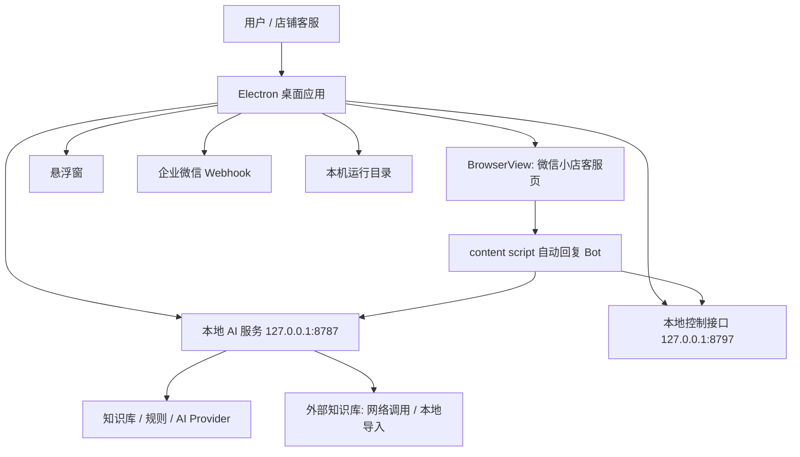

# 小店AI客服项目架构规范

本文是本项目最高优先级的工程规范。涉及架构边界、模块职责、运行时行为、配置安全、UI 入口、测试发布和文档同步时，先遵守本文；若本文和专题文档冲突，以本文为准。

## 项目定位

小店AI客服是一个微信小店客服 Electron 桌面自动回复工具。它把微信小店客服页嵌入桌面应用，通过本地规则、AI 回复、外部知识库、页面动作和企业微信 Webhook，辅助店铺客服长期值守。

项目边界：

- 这是桌面自动化工具，不是微信小店官方 SDK。
- 只在使用者自己的店铺、账号权限和平台规则范围内运行。
- 外部知识库、DeepSeek API、企业微信机器人等外部服务必须由使用者自行授权。
- 项目不得提供、绕过或伪造任何第三方权限。

## 文档优先级

文档按以下顺序解释项目规则：

1. `ARCHITECTURE.md`：项目总规范和架构事实来源。
2. `CONTRIBUTING.md`：协作、变更、验证和安全准入规则。
3. `README.md`：用户和新开发者入口。
4. `docs/README.md`：专题文档导航。
5. `docs/*`：专题说明、历史记录和发布说明。

以后改动以下能力时，必须同步对应文档：Electron 窗口、菜单、托盘、悬浮窗、回复决策顺序、规则匹配、AI 兜底、外部知识库网络调用、本地导入、访问凭证、外部知识库查询、Webhook、通知补发、回复记录、配置文件、运行目录、打包文件、安全边界、发布流程和安装包命名。

## 文档语言规则

项目文档默认使用中文。除非属于必须保留英文的格式内容，否则用户可见的标题、段落、表格、说明、发布记录和规范条款都要优先用中文表达。

必须保留英文或原文的内容包括：

- 文件名、目录名、命令、脚本名、npm script、环境变量、代码标识、JSON 字段、IPC 名称和 selector。
- 产品名、系统名、协议名、API 名、第三方服务名、许可证名和安装包文件名。
- 错误信息、日志原文、提交标题、版本标签、URL、下载资产名和必须精确匹配的配置值。

允许中英混写的前提是英文承担格式或识别作用，例如 `BrowserView`、`Webhook`、`API Key`、`GitHub Actions`、`test:release-readiness`。如果英文只是普通说明词，例如 fallback、source of truth、Top Bar、Release Notes，应写成中文，例如“兜底”“事实来源”“顶部栏”“发布说明”。

## 系统边界



核心运行面：

- Electron 主进程负责窗口、托盘、悬浮窗、本地服务、配置、通知、页面动作和生命周期。
- 微信小店客服页运行在 `BrowserView`，不是普通外链页面。
- content script 负责读取客服页、检测消息、触发规则和调用本地能力。
- 本地 AI 服务负责知识库搜索、AI 回复、承接语和等待语。
- 外部知识库可以通过网络接口实时调用，也可以导入到本机缓存后本地检索；访问凭证和导入缓存只保存在本机运行目录。
- Webhook 只做通知和总结，不是回复链路的唯一事实来源。

## 模块职责

| 路径 | 职责 | 约束 |
| --- | --- | --- |
| `desktop/` | Electron 主进程、主控台、悬浮窗、preload、状态中心、配置校验 | 只放桌面壳和运行时编排；不得把规则匹配算法复制到 UI |
| `extension/` | 注入客服页的 content script、弹窗和浏览器扩展产物 | 只处理页面内观测和动作触发；敏感配置通过受控接口读取 |
| `src/` | CLI、AI 客户端、规则匹配、知识库、外部知识库查询、文本工具 | 共享业务逻辑优先放这里，避免 desktop 和 extension 重复实现 |
| `config/` | 默认规则、默认 AI 风格、承接语、随包图片 | 只放可随安装包分发的默认资产，不放真实密钥或私有缓存 |
| `knowledge-base/` | 默认知识库素材 | 只放可公开分发的知识内容 |
| `scripts/` | 构建、安装、测试、发布检查、诊断脚本 | 脚本必须可重复运行，不能依赖个人机器隐式状态 |
| `docs/` | 专题文档、发布说明、历史记录 | 专题文档必须链接回上级规范 |

## 核心数据流

### 启动与恢复

1. Electron 启动并申请单实例锁。
2. 迁移或创建用户运行目录，加载 `.env`、`desktop-config.json`、规则、AI 配置和运行状态。
3. 启动本地 AI 服务和本地控制接口。
4. 创建主窗口、客服页 `BrowserView`、悬浮窗和托盘。
5. 校验 AI、Webhook、外部知识库授权、客服页登录和 Bot 心跳。
6. 窗口关闭默认隐藏，彻底退出必须停止后台服务并保存运行状态。

### 登录与授权

微信小店登录发生在客服页。外部知识库网络调用使用独立 Electron 持久会话保存访问状态。外部知识库授权必须通过真实远端查询验证，不能只根据本地凭证存在判断成功；本地导入模式必须记录导入来源、时间和记录数量。

授权失败处理：

- `401`：凭证失效，提示重新配置。
- `403`：账号缺少权限。
- `404`：检查服务地址或接口。
- 网络失败：保留本地状态，等待后续自检或手动重试。

### 回复决策

回复链路必须保持确定性优先：

1. Bot 是否开启。
2. 当前会话是否有新的客户消息。
3. 最后一条是否来自客服本人。
4. 是否重复处理过同一条消息。
5. 匹配动作规则。
6. 匹配独立图片规则。
7. 匹配文字规则。
8. 查询本地知识库、外部知识库和 AI。
9. AI 超时后发送承接语或兜底语。
10. 记录回复结果、追踪记录、状态和 Webhook 汇总。

AI 只能作为兜底或补充判断，不得覆盖已命中的确定性规则。

### 页面动作

页面动作必须由统一动作入口执行，不能在多个 UI 中复制 DOM 操作。允许的动作类型包括文字、图片、文件、商品卡片、邀请下单、素材库、快捷回复、忽略、页面结构捕捉和打开悬浮窗。

改动页面动作时必须记录：

- 测试页面状态。
- 触发消息或操作。
- 发送类型和结果。
- 是否写入回复记录和状态追踪。
- 页面结构是否发生变化。

### 通知和记录

回复记录、通知补发、小时总结和每日总结是长期运行能力的一部分。

- 回复成功、失败、超时都要写入回复记录。
- Webhook 失败进入补发队列。
- 正常健康检查不刷屏，异常和恢复需要明确反馈。
- 通知内容不得包含 API Key、访问凭证、Webhook URL、控制 Token 或可复用凭证。

## 平台规则

### macOS

macOS 使用屏幕顶部系统菜单栏承载全局业务命令。业务菜单以 `设置`、`工作台设定`、`Bot`、`悬浮窗`、`API` 为准，详见 `docs/desktop-native-menu-guidelines.md`。

运行目录：

```text
~/Library/Application Support/小店AI客服/
```

### Windows

Windows 不使用屏幕顶部系统菜单栏，也不显示传统全宽菜单栏。Windows 使用小型三条杠菜单展开和 macOS 一一对应的业务菜单。

运行目录：

```text
%APPDATA%/小店AI客服/
```

### 托盘和悬浮窗

托盘是后台恢复入口，不是完整设置中心。悬浮窗只显示状态和少量高频动作，不承担复杂配置。关闭悬浮窗等于隐藏，不等于退出程序。

## 配置和安全边界

不得提交或打包真实敏感信息：

- DeepSeek API Key。
- 企业微信 / WeCom Webhook URL。
- 外部知识库访问凭证、session token 或授权历史。
- Desktop control Token。
- `.env`、个人运行缓存、私有外部知识库导入缓存或导出。
- 微信小店登录态、Chrome profile、截图里的二维码或会话隐私。

默认配置只能包含可公开分发的规则、图片、知识库和空白示例。日志、截图、fixture、发布说明如果包含凭证或隐私，必须先脱敏。

## UI 和信息架构

主控台是操作工作台，不是营销页。设计原则：

- 高密度、可扫描、适合长期值守。
- 状态不是按钮，操作才是按钮。
- 页面内工具栏只放当前对象相关操作。
- 全局命令归入 macOS 菜单栏、Windows 三条杠菜单、托盘和快捷键。
- 菜单规范以 `docs/desktop-native-menu-guidelines.md` 为准。
- 工作台结构演进以 `docs/workbench-optimization-plan.md` 为准。
- 运行状态词典以 `docs/runtime-statuses.md` 为准。

## 测试矩阵

| 改动类型 | 必跑检查 |
| --- | --- |
| 文档、链接、规范 | `git diff --check`, `npm run doctor`, `npm run check:secrets` |
| 规则匹配、文本处理、AI 逻辑 | `npm run test:extension-modules`, `npm run test:ai-knowledge`, `npm run test:baseline` |
| Electron 主进程、窗口、生命周期 | `npm run test:desktop-modules`, `npm run test:lifecycle`, `npm run doctor` |
| 主控台、悬浮窗、状态 UI | `npm run test:status-ui`, 必要时补充截图说明 |
| 页面动作、登录、图片/文件/商品发送 | `npm run test:regressions`, 页面结构捕捉和人工验证说明 |
| 安全、配置、发布 | `npm run check:secrets`, `npm run test:release-readiness`, `npm run test:packaged-resources` |
| macOS 打包 | `npm run dist:mac`, `npm run test:macos-package` |
| Windows 打包 | `npm run dist:win`, `npm run test:windows-packages` 或 GitHub Actions 结果 |

测试无法运行时，必须写明原因、影响范围和替代验证。

## 变更准入

提交或 PR 必须说明：

- 改了什么行为或文档。
- 为什么要改。
- 风险和回滚方式。
- 跑过哪些检查。
- 是否涉及敏感配置、第三方权限、页面自动化或发布产物。

以下改动不得只改代码不改文档：

- 窗口、菜单、托盘、悬浮窗入口变化。
- 回复决策顺序、规则格式、动作类型变化。
- AI、外部知识库、Webhook、控制接口变化。
- 运行目录、配置文件、安装包命名变化。
- 用户可见流程、首次初始化、发布下载链接变化。

## 当前保留的专题文档

- `docs/README.md`：专题文档导航。
- `docs/customer-reply-rule-library.md`：规则库写法。
- `docs/desktop-app-structure-deployment.md`：桌面结构和部署细节。
- `docs/desktop-native-menu-guidelines.md`：原生菜单和 Windows 三条杠菜单规范。
- `docs/runtime-statuses.md`：运行状态词典。
- `docs/wechat-kf-page-structure.md`：客服页结构记录。
- `docs/workbench-optimization-plan.md`：工作台演进方案。
- `docs/rich-user-guide.md`：图文使用说明。
- `docs/mac-install-troubleshooting.md`：macOS 安装疑难。
- `docs/project-journey.md`：项目历程。
- `docs/release-notes/`：历史发布说明。
