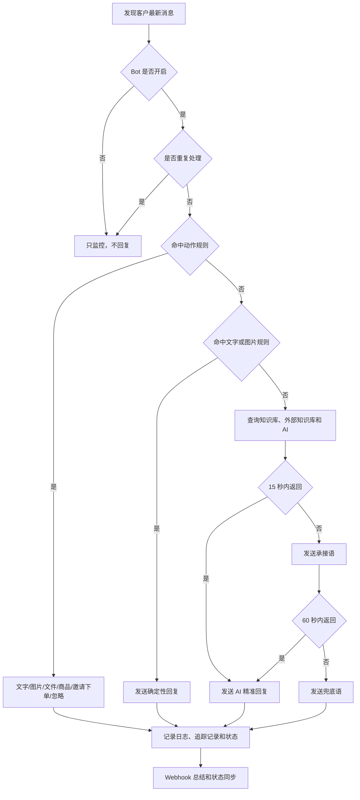

# 小店AI客服

[](https://github.com/JahanHe/Shop-ai-reply/actions/workflows/build-installers.yml)
[](https://github.com/JahanHe/Shop-ai-reply/releases/tag/v0.4.2)
[](LICENSE)

小店AI客服是一个微信小店客服桌面自动回复工具。它把微信小店客服页映射到 Electron 桌面应用里，并提供规则库、AI 回复、外部知识库、商品卡片/邀请下单、图片/文件发送、Webhook 通知、悬浮窗和长期运行守护。

> 微信小店客服页属于第三方网页映射与自动化场景，请在自己的店铺、账号权限和平台规则范围内谨慎使用。外部知识库是私有外部服务，需要授权账号和权限；本项目不会提供或绕过任何第三方权限。

## 下载

正式安装包在 GitHub 发布页，不在 Packages。

| 系统 | 文件 |
| --- | --- |
| macOS Apple Silicon | [xiaodian-ai-kefu-macos-arm64.dmg](https://github.com/JahanHe/Shop-ai-reply/releases/download/v0.4.2/xiaodian-ai-kefu-macos-arm64.dmg) |
| Windows 安装版 | [xiaodian-ai-kefu-windows-setup.exe](https://github.com/JahanHe/Shop-ai-reply/releases/download/v0.4.2/xiaodian-ai-kefu-windows-setup.exe) |
| Windows 便携版 | [xiaodian-ai-kefu-windows-portable.exe](https://github.com/JahanHe/Shop-ai-reply/releases/download/v0.4.2/xiaodian-ai-kefu-windows-portable.exe) |

macOS 如果提示“无法验证开发者”，看：[docs/mac-install-troubleshooting.md](docs/mac-install-troubleshooting.md)。

发布说明：[docs/release-notes/v0.4.2.md](docs/release-notes/v0.4.2.md)

历史变更：[CHANGELOG.md](CHANGELOG.md)

## 当前重点

| 方向 | 内容 |
| --- | --- |
| 桌面工作台 | 主控台承载客服页、回复中心、运行监控和系统设置 |
| 菜单规范 | 后续 Mac 使用系统菜单栏，Windows 使用小型三条杠菜单，详见 [桌面端原生菜单设计规范](docs/desktop-native-menu-guidelines.md) |
| 回复动作 | 支持文字、图片、文件、商品卡片、邀请下单、忽略和 AI 后续回复 |
| 规则匹配 | 真实会话和手动测试共用规则匹配逻辑，减少测试和实际行为差异 |
| 状态可见 | 主控台、悬浮窗、托盘、Webhook 和回复记录同步展示运行状态 |
| 安全边界 | API Key、Webhook、外部知识库访问凭证、控制 Token 和运行缓存只保存在本机运行目录 |

## 首次初始化

第一次打开会进入系统设置初始化流程。换电脑、清空配置或外部知识库凭证失效时，也可以从系统设置重新修复。

| 步骤 | 做什么 |
| --- | --- |
| 1 | 填写 DeepSeek API Key |
| 2 | 填写企业微信机器人 Webhook |
| 3 | 配置外部知识库：可选择网络调用，也可导入本地数据 |
| 4 | 网络调用模式点击“获取访问凭证”并做真实查询；本地导入模式确认记录数量 |
| 5 | 点击“保存并自检”，检查 AI、Webhook、外部知识库、规则库和长期运行状态 |
| 6 | 进入客服工作台，扫码登录微信小店客服页并选中会话 |

敏感信息只写入本机运行目录，不进入仓库和安装包。

## 日常使用

| 入口 | 用途 |
| --- | --- |
| 客服工作台 | 微信小店客服原网页映射，扫码、选会话、聊天都在这里 |
| 回复中心 | 管理动作规则、文字规则、图片规则、Bot 策略、AI 风格和外部知识库 |
| 运行监控 | 查看当前状态、回复日志、AI 追踪记录、外部知识库命中、Webhook 队列和失败原因 |
| 系统设置 | 初始化、Webhook、悬浮窗、开机启动、帮助说明和彻底退出 |
| 悬浮窗 | 显示当前状态，并保留打开控制台、暂停/开启 Bot 等高频动作 |
| 托盘 / Dock | 主窗口隐藏后恢复程序，或执行后台运行相关动作 |

关闭主窗口只是隐藏，Bot 继续运行。彻底退出会停止 Bot、AI、本机控制服务、Webhook 调度和悬浮窗，必须通过明确退出入口确认。

## 回复流程



确定性规则优先，AI 只做兜底或补充判断。

## 本地开发

```bash
npm install
npm run build-extension
npm run desktop
```

常用检查：

```bash
npm run test:extension-modules
npm run test:status-ui
npm run test:release-readiness
npm run check:secrets
npm run doctor
```

打包：

```bash
npm run dist:mac
npm run dist:win
```

## 文档入口

| 读者 / 场景 | 先看 |
| --- | --- |
| 想理解项目架构和维护边界 | [ARCHITECTURE.md](ARCHITECTURE.md) |
| 准备贡献或提交 PR | [CONTRIBUTING.md](CONTRIBUTING.md) |
| 查找所有专题文档 | [docs/README.md](docs/README.md) |
| 学习图文安装和使用 | [docs/rich-user-guide.md](docs/rich-user-guide.md) |
| 编写或调整回复规则 | [docs/customer-reply-rule-library.md](docs/customer-reply-rule-library.md) |
| 理解桌面结构和部署 | [docs/desktop-app-structure-deployment.md](docs/desktop-app-structure-deployment.md) |
| 维护客服页自动化 selector | [docs/wechat-kf-page-structure.md](docs/wechat-kf-page-structure.md) |
| 调整工作台信息架构 | [docs/workbench-optimization-plan.md](docs/workbench-optimization-plan.md) |
| 调整 Mac/Windows 菜单 | [docs/desktop-native-menu-guidelines.md](docs/desktop-native-menu-guidelines.md) |
| 查看状态词典 | [docs/runtime-statuses.md](docs/runtime-statuses.md) |
| 回看项目演进和发布背景 | [docs/project-journey.md](docs/project-journey.md) |
| 处理 macOS 安装拦截 | [docs/mac-install-troubleshooting.md](docs/mac-install-troubleshooting.md) |

## 开源和边界

本项目使用 MIT 许可证开源。代码可以学习、修改和分发，但使用者必须自行确认：

- 微信小店账号、客服页、商品、会话和自动化行为符合平台规则。
- 外部知识库、DeepSeek API、企业微信机器人等外部服务已经获得合法授权。
- 不把 API Key、Webhook、外部知识库访问凭证、控制 Token、个人缓存、私有外部知识库数据提交到仓库或安装包。

更多协作规则见 [CONTRIBUTING.md](CONTRIBUTING.md)。
