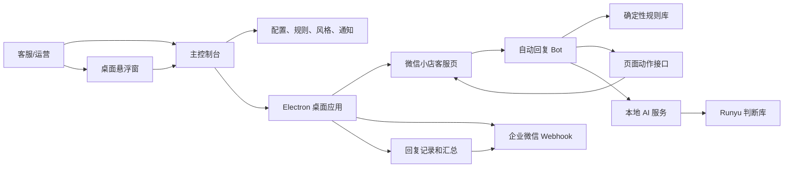
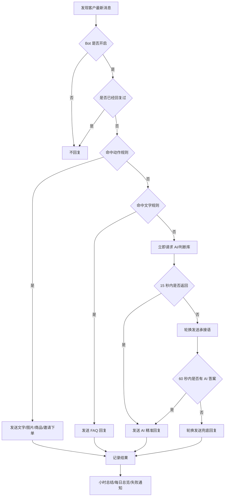

# 微信小店客服自动回复桌面工作台

[](https://github.com/JahanHe/wechat-autoreply/actions/workflows/build-installers.yml)
[](https://github.com/JahanHe/wechat-autoreply/releases/tag/v0.3.0)

> README 是这个项目的第一章：先告诉你这个工具能做什么、怎么下载、首次怎么配置；更细的规则、页面结构、Webhook、打包部署和项目历程，都从这里进入对应文档。

## 先看结论

这是一个把微信小店客服页封装成桌面应用的自动回复工具。它包含独立桌面控制台、客服页映射、悬浮窗、本地 AI 服务、可视化规则库、图片/商品动作、外部判断库增强、企业微信 Webhook 通知和 GitHub Actions 安装包发布流程。

| 你关心的问题 | 当前答案 |
| --- | --- |
| 下载入口在哪里？ | 在 [GitHub Releases v0.3.0](https://github.com/JahanHe/wechat-autoreply/releases/tag/v0.3.0)，不是 Packages |
| 首次运行要配什么？ | DeepSeek API Key、企业微信机器人 Webhook、微信小店扫码登录；判断库可选填 Runyu Cookie |
| 下载后默认有什么？ | 文字回复、图片回复、商品卡片、邀请下单、悬浮窗、Webhook 汇总 |
| 规则会不会丢？ | 安装包首次运行会自动初始化默认规则和图片，升级时补齐缺失规则 |
| 密钥会不会提交到 GitHub？ | 不会，真实 Key 和 Webhook 只写入本机运行目录的 `.env` |

## 快速下载

当前正式版本：`v0.3.0`

| 系统 | 下载 |
| --- | --- |
| macOS Apple Silicon | [wechat-autoreply-macos-arm64.dmg](https://github.com/JahanHe/wechat-autoreply/releases/download/v0.3.0/wechat-autoreply-macos-arm64.dmg) |
| Windows 安装版 | [wechat-autoreply-windows-setup.exe](https://github.com/JahanHe/wechat-autoreply/releases/download/v0.3.0/wechat-autoreply-windows-setup.exe) |
| Windows 便携版 | [wechat-autoreply-windows-portable.exe](https://github.com/JahanHe/wechat-autoreply/releases/download/v0.3.0/wechat-autoreply-windows-portable.exe) |

发布说明：[docs/release-notes/v0.3.0.md](docs/release-notes/v0.3.0.md)

首次打开后做三件事：

| 步骤 | 位置 | 做什么 |
| --- | --- | --- |
| 1 | 主控制台 > API 接入 | 填 DeepSeek API Key，并点真实回复测试 |
| 2 | 主控制台 > Webhook | 填企业微信机器人 Webhook，并点测试 |
| 3 | 主控制台 > 客服页映射 | 微信扫码登录并选中客服会话 |

## 一张图看懂



自动回复优先级：



## 默认能力

当前内置规则围绕“润宇年度会员商业社群”配置，商品码为 `10000275472384`。

主控制台现在是主要操作入口：

| 页面 | 能做什么 |
| --- | --- |
| 客服页映射 | 保留微信小店原客服页，登录、选会话和聊天都在这里 |
| 总览状态 | 查看 Bot、AI、Webhook、客服页、悬浮窗和回复记录 |
| Bot 接管 | 开启/暂停 Bot，调整承接语、超时、图片和页面动作能力 |
| API 接入 | 配 DeepSeek Key、模型、Base URL、风格、知识库和测试回复 |
| 判断库 | 配 Runyu Cookie、来源、类型、全局下载、自动刷新和测试 10 条 |
| Webhook | 配企业微信通知、事件规则、小时总结、每日总览和补发队列 |
| 规则库 | 用卡片编辑文字、图片、商品卡片、邀请下单、文件和忽略规则 |
| 日志库 | 追踪每次回复来自规则库、直接承接、AI 接管还是判断库补充 |
| 悬浮窗 | 打开、隐藏、置顶和调整悬浮窗尺寸 |

| 场景 | 默认动作 |
| --- | --- |
| 想买会员、会员链接、会员入口 | 发年度会员商品卡片 |
| 怎么买、怎么付款、怎么下单 | 邀请下单 |
| 会员权益、课程目录、包含什么 | 文字加目录图 |
| 怎么使用会员专区、怎么进群 | 文字加说明图 |
| 月度会员取消自动续费 | 文字加图 |
| 咨询俱乐部、产品详情 | 文字加图 |
| 加微信、微信号、留电话、留手机号 | 平台内沟通合规提示 |
| 谢谢、明白了、OK | 标记已处理，不再补话 |

### 默认图片预览

这些图片会随安装包一起复制到运行目录，用在图文回复规则里。

| 图片 | 用途 |
| --- | --- |
|  | 会员专区使用说明 |
|  | 进群/小程序路径补充 |
|  | 会员权益和目录说明 |
|  | 月度会员取消自动续费 |
|  | 咨询俱乐部详情 |

## 文档路由

docs 里有更详细的解释。README 只做入口，按你要解决的问题进入对应文件：

| 你想做什么 | 直接看 |
| --- | --- |
| 按图文说明安装、配置 API、Webhook、规则和图片 | [docs/rich-user-guide.md](docs/rich-user-guide.md) |
| 写自己的回复规则：什么时候发文字、图片、商品、邀请下单 | [docs/customer-reply-rule-library.md](docs/customer-reply-rule-library.md) |
| 理解桌面版怎么运行、运行目录在哪里、Webhook 怎么汇总 | [docs/desktop-app-structure-deployment.md](docs/desktop-app-structure-deployment.md) |
| 理解微信小店客服页结构，后续控制商品、素材库、快捷语 | [docs/wechat-kf-page-structure.md](docs/wechat-kf-page-structure.md) |
| 看项目从浏览器脚本到桌面安装包的完整历程 | [docs/project-journey.md](docs/project-journey.md) |
| 查看当前发行版的富文本说明 | [docs/release-notes/v0.3.0.md](docs/release-notes/v0.3.0.md) |
| 使用旧迁移包或源码方式安装 | [PORTABLE_INSTALL.md](PORTABLE_INSTALL.md) |
| Windows 手动安装和任务计划说明 | [WINDOWS_INSTALL.md](WINDOWS_INSTALL.md) |

## 规则长什么样

动作规则可以直接在主控制台 > 规则库里用卡片编辑。高级 JSON 只作为批量排查和迁移入口。例子：

```json
{
  "enabled": true,
  "name": "会员专区：邀请下单",
  "keywords": ["怎么付款", "怎么买", "怎么购买", "怎么下单", "我要下单"],
  "actions": [
    {
      "type": "text",
      "text": "我给您选好年度会员\n您点进去就可以下单"
    },
    {
      "type": "product",
      "productId": "10000275472384",
      "productName": "润宇年度会员商业社群",
      "button": "邀请下单"
    }
  ]
}
```

可用动作包括：

| 动作 | 用途 |
| --- | --- |
| `text` | 发送文字 |
| `image` | 上传并发送本地图片 |
| `file` | 上传并发送文件 |
| `product` | 发商品卡片或邀请下单 |
| `material` | 发送素材库内容，当前默认规则未启用 |
| `quick_reply` | 发送后台快捷语，当前默认规则未启用 |
| `ignore` | 命中后不发送，标记已处理 |

图片和文件动作的 `path` 在主控制台 > 规则库里可以直接操作：手动编辑、点“选择/替换”改成新图片或文件，或点“打开位置”直达当前文件所在目录。

## 外部判断库

判断库用于复杂问题的精准补充：Bot 会先请求 AI/判断库，15 秒还没结果才轮换发送承接语，60 秒还没有可用答案才轮换发送兜底回复。

| 配置项 | 说明 |
| --- | --- |
| `RUNYU_WEB_COOKIE` | 只写本机 `.env`，格式 `session_token=...`，不会提交到仓库 |
| 来源 | `runyu`、`liurun`、`xiangshui`、`xingxing`、`book`、`dedao` |
| 类型 | 判断、引语、案例 |
| 全部下载本地库 | 按来源、类型、关键词分页下载并增量合并，前端显示进度条 |
| 自动刷新 | 可选每 24 小时、3 天、7 天、14 天、30 天刷新 |
| 日志来源 | 使用判断库生成的回复会标记为“判断库补充” |

当前 Runyu API 文档没有单独的全量导出游标，所以“全部下载”会按已选来源、类型和关键词分页拉取；同一条记录用 id 或内容哈希去重，内容变化时更新本地缓存。

## 本地开发

```bash
npm install
npm run desktop
```

常用检查：

```bash
npm run check:secrets
npm run build-extension
npm run doctor
```

配置并测试企业微信 Webhook：

```bash
npm run configure:webhook -- "https://qyapi.weixin.qq.com/cgi-bin/webhook/send?key=你的key"
npm run test:webhook
```

## 运行目录

| 内容 | 仓库默认文件 | 运行时文件 |
| --- | --- | --- |
| 默认回复规则 | `config/replies.json` | `desktop-config.json` |
| 回复图片 | `config/reply-images/` | `config/reply-images/` |
| 助手风格和知识库 | `config/assistant-profile.json` | `assistant-profile.json` |
| FAQ 知识库 | `knowledge-base/customer-service.md` | 随安装包读取 |
| API Key / Webhook | 不进仓库 | `.env` |

macOS：

```text
~/Library/Application Support/wechat-shop-kf-bot/
```

Windows：

```text
%APPDATA%/wechat-shop-kf-bot/
```

## 构建发布

```bash
npm run dist:mac
npm run dist:win
```

GitHub Actions：

- 工作流：[.github/workflows/build-installers.yml](.github/workflows/build-installers.yml)
- 推送到 `main` 会构建 macOS 和 Windows 产物，作为 Actions artifacts。
- 推送 `v*` 标签会创建 GitHub Release，并上传 DMG、Windows 安装版和便携版。
- 构建前会执行 `npm run check:secrets`，避免真实密钥进入仓库。

## 安全边界

- 不要提交或转发 `.env`。
- 真实 DeepSeek API Key 和企业微信 Webhook 只应保存在本机运行目录。
- 工具不会绕过扫码、验证码或平台风控；需要人工登录时会通过 Webhook 通知。
- 严禁引导客户加微信、打电话、私聊、留手机号或私下交易。
