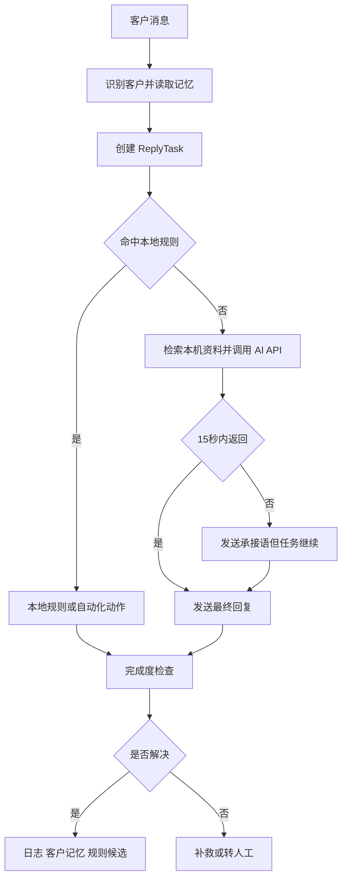

# 小店AI客服

[](https://github.com/JahanHe/Shop-ai-reply/actions/workflows/build-installers.yml)
[](https://github.com/JahanHe/Shop-ai-reply/releases/tag/v0.4.6)
[](LICENSE)

小店AI客服是一个微信小店客服桌面自动回复工具。它将客服页映射到 Electron 桌面应用，并提供本地规则、AI API、图片/文件、商品卡、邀请下单、Webhook、悬浮窗、回复任务和长期运行守护。

> 微信小店客服页属于第三方网页映射与自动化场景，请仅在自己的店铺、账号权限和平台规则范围内使用。外部知识源属于私有服务，需要合法账号和权限；本项目不会提供或绕过第三方权限。

## 下载

安装包发布在 GitHub Releases，不在 Packages。

| 系统 | 下载 |
| --- | --- |
| macOS Apple Silicon | [xiaodian-ai-kefu-macos-arm64.dmg](https://github.com/JahanHe/Shop-ai-reply/releases/download/v0.4.6/xiaodian-ai-kefu-macos-arm64.dmg) |
| Windows 安装版 | [xiaodian-ai-kefu-windows-setup.exe](https://github.com/JahanHe/Shop-ai-reply/releases/download/v0.4.6/xiaodian-ai-kefu-windows-setup.exe) |
| Windows 便携版 | [xiaodian-ai-kefu-windows-portable.exe](https://github.com/JahanHe/Shop-ai-reply/releases/download/v0.4.6/xiaodian-ai-kefu-windows-portable.exe) |

- 发布说明：[v0.4.6](docs/release-notes/v0.4.6.md)
- 历史变更：[CHANGELOG.md](CHANGELOG.md)
- macOS 无法验证开发者：[安装处理说明](docs/mac-install-troubleshooting.md)

## v0.4.6 重点

| 模块 | 当前行为 |
| --- | --- |
| 知识体系 | 知识库新增客户记忆页，规则库、AI参考、测试中心和记忆分层管理 |
| 客户记忆 | 支持搜索、展开追踪、批量本机压缩和 AI 压缩，保留最近对话和长期摘要 |
| AI参考 | 长文本改为 Markdown 预览卡片，点击图标进入弹窗编辑 |
| 监控看板 | 状态总览改为视觉卡片、比例条和右侧详情，不再堆叠重复快捷操作 |
| 图标交互 | 行内编辑、复用、启停、删除、压缩、复制等操作使用图标按钮和 tooltip |
| 通知图标 | macOS/Windows 本机通知统一使用最新应用 logo |

## 知识与回复逻辑

```text
客户消息
├─ 命中本地规则库
│  └─ 直接发送文字、图片、文件、商品卡或邀请下单
└─ 未命中规则库
   └─ 本机回复中转服务
      ├─ 读取客户历史和回复人格
      ├─ 检索本机自建资料
      ├─ 检索已下载的外部同步资料
      └─ 调用远方 AI API 生成回复
```

外部资料流程：

```text
外部知识源
→ 验证权限
→ 首次下载或增量同步
→ 保存到本机独立缓存
→ 建立本机索引并保留来源标识
→ AI 回复只检索本机索引
```

Cookie 过期或网络中断只会影响资料更新，不会阻止程序继续使用上一次成功下载的本机资料。

## 主控台结构

| 一级入口 | 二级功能 |
| --- | --- |
| 工作台 | 微信小店客服页映射和当前会话 |
| 知识库 | 知识总览、规则库、AI 参考、测试中心、客户记忆 |
| 监控 | 状态总览、回复日志、异常和 Webhook 队列 |
| 设置 | 初始化、Bot 策略、AI API、外部知识同步、Webhook、悬浮窗和帮助 |

规则库支持文字、组合动作、图片、文件、商品卡、邀请下单和规则候选。规则行默认只显示状态、名称、关键词、模式、动作摘要和修改时间，展开后才加载完整编辑器和图片预览。

测试中心默认只模拟。真实动作必须选择当前客服会话，并进行二次确认。

客户记忆会记录最近客户消息、客服回复、已发送规则、已执行动作和未完成任务。内容过长时可以在知识库 > 客户记忆中手动压缩：本机压缩不联网，AI 压缩会调用已配置的远方 AI API。

## 首次初始化

| 步骤 | 操作 |
| --- | --- |
| 1 | 配置 DeepSeek 兼容 API Key、Base URL 和模型 |
| 2 | 按需配置企业微信 Webhook |
| 3 | 打开外部知识同步页，完成授权并下载资料到本机 |
| 4 | 保存并执行安全自检 |
| 5 | 进入工作台扫码登录微信小店客服页 |
| 6 | 在测试中心先运行模拟测试，再开启 Bot |

敏感信息只写入本机运行目录，不进入仓库或安装包。

## 回复任务闭环



15 秒承接语不是最终回复。60 秒默认只标记延迟、写日志和通知。客户可见自动补救最多两次，之后转人工。

## 本地开发

```bash
npm install
npm run build-extension
npm run desktop
```

核心检查：

```bash
npm run test:local-knowledge
npm run test:production-local-only
npm run test:extension-modules
npm run test:status-ui
npm run test:regressions
npm run test:release-readiness
npm run check:secrets
npm run doctor
```

打包：

```bash
npm run dist:mac
npm run dist:win
```

## 文档入口

| 内容 | 文档 |
| --- | --- |
| 全部专题索引 | [docs/README.md](docs/README.md) |
| 图文安装和使用 | [docs/rich-user-guide.md](docs/rich-user-guide.md) |
| 规则库和动作 | [docs/customer-reply-rule-library.md](docs/customer-reply-rule-library.md) |
| 工作台信息架构 | [docs/workbench-optimization-plan.md](docs/workbench-optimization-plan.md) |
| 桌面结构与部署 | [docs/desktop-app-structure-deployment.md](docs/desktop-app-structure-deployment.md) |
| 客服页自动化结构 | [docs/wechat-kf-page-structure.md](docs/wechat-kf-page-structure.md) |
| 运行状态词典 | [docs/runtime-statuses.md](docs/runtime-statuses.md) |
| 项目演进 | [docs/project-journey.md](docs/project-journey.md) |
| 架构和维护边界 | [ARCHITECTURE.md](ARCHITECTURE.md) |
| 参与贡献 | [CONTRIBUTING.md](CONTRIBUTING.md) |

## 开源边界

本项目使用 MIT License。使用者需要自行确认：

- 微信小店账号、会话、商品和自动化行为符合平台规则。
- DeepSeek API、企业微信机器人和外部知识源已经获得合法授权。
- 不提交 API Key、Webhook、Cookie、控制 Token、个人缓存或私有同步资料。

贡献与安全要求见 [CONTRIBUTING.md](CONTRIBUTING.md)。
