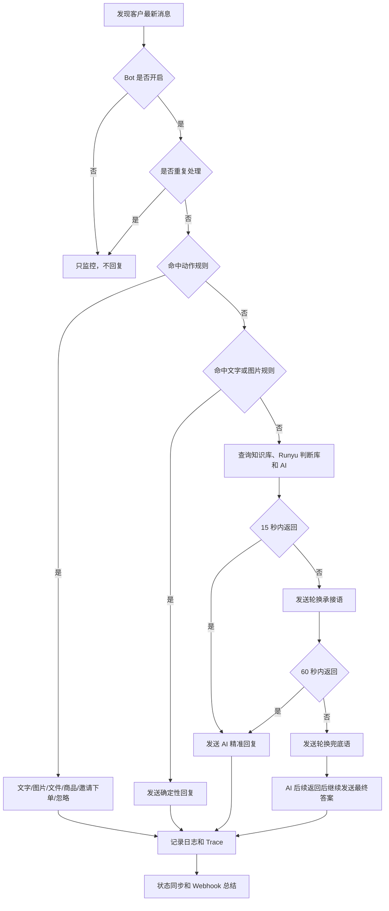

# 小店AI客服

[](https://github.com/JahanHe/wechat-autoreply/actions/workflows/build-installers.yml)
[](https://github.com/JahanHe/wechat-autoreply/releases/tag/v0.4.0)
[](LICENSE)

小店AI客服是一个微信小店客服桌面自动回复工具。它把微信小店客服页映射到 Electron 桌面应用里，并提供规则库、AI 回复、Runyu 判断库、商品卡片/邀请下单、图片/文件发送、Webhook 通知、悬浮窗和长期运行守护。

> 微信小店客服页属于第三方网页映射与自动化场景，请在自己的店铺、账号权限和平台规则范围内谨慎使用。Runyu 判断库是私有外部服务，需要授权账号和权限；本项目不会提供或绕过任何第三方权限。

## 下载

正式安装包在 GitHub Releases，不在 Packages。

| 系统 | 文件 |
| --- | --- |
| macOS Apple Silicon | [xiaodian-ai-kefu-macos-arm64.dmg](https://github.com/JahanHe/wechat-autoreply/releases/download/v0.4.0/xiaodian-ai-kefu-macos-arm64.dmg) |
| Windows 安装版 | [xiaodian-ai-kefu-windows-setup.exe](https://github.com/JahanHe/wechat-autoreply/releases/download/v0.4.0/xiaodian-ai-kefu-windows-setup.exe) |
| Windows 便携版 | [xiaodian-ai-kefu-windows-portable.exe](https://github.com/JahanHe/wechat-autoreply/releases/download/v0.4.0/xiaodian-ai-kefu-windows-portable.exe) |

发布说明：[docs/release-notes/v0.4.0.md](docs/release-notes/v0.4.0.md)

历史变更：[CHANGELOG.md](CHANGELOG.md)

macOS 如果提示“无法验证开发者”，看：[docs/mac-install-troubleshooting.md](docs/mac-install-troubleshooting.md)。

## v0.4.0 重点

| 方向 | 内容 |
| --- | --- |
| 规则匹配 | 真实会话和手动测试共用同一套规则匹配逻辑，减少“测试能命中、实际不回复”的问题 |
| 回复动作 | 支持文字、图片、文件、商品卡片、邀请下单、忽略、AI 后续回复 |
| 状态可见 | 主控台和悬浮窗同步显示检测、规则、判断库、AI、发送和失败状态 |
| 悬浮窗 | 展开态固定排版，最小化态保留打开控制台、展开、隐藏三个按钮 |
| 安装包 | macOS/Windows 资源完整性和启动冒烟测试进入发布门禁 |
| 开源材料 | 新增 README、CHANGELOG、LICENSE、CONTRIBUTING 作为开源入口 |

## 首次初始化

第一次打开会进入 `系统设置 > 初始化`。换电脑、清空配置或判断库凭证失效时，也可以从这里重新修复。

| 步骤 | 做什么 |
| --- | --- |
| 1 | 填写 DeepSeek API Key |
| 2 | 填写企业微信机器人 Webhook |
| 3 | 打开 Runyu 登录网页，在 5 分钟内完成网页登录 |
| 4 | 点击“我已登录，获取凭证”，让程序读取本机 Cookie Token 并做真实查询 |
| 5 | 点击“保存并自检”，检查 AI、Webhook、判断库、规则库和长期运行状态 |
| 6 | 进入 `客服工作台`，扫码登录微信小店客服页并选中会话 |

敏感信息只写入本机运行目录：API Key、Webhook、Cookie、控制 Token 不进入仓库和安装包。

## 主控台结构

| 一级入口 | 用途 |
| --- | --- |
| 客服工作台 | 微信小店客服原网页映射，扫码、选会话、聊天都在这里 |
| 回复中心 | 管理动作规则、文字规则、图片规则、Bot 策略、API 风格和 Runyu 判断库 |
| 运行监控 | 查看当前状态、回复日志、AI Trace、判断库命中、Webhook 队列和失败原因 |
| 系统设置 | 初始化、Webhook、悬浮窗、开机启动、帮助说明和彻底退出 |

悬浮窗只显示状态和两个高频动作：打开控制台、暂停/开启 Bot。关闭悬浮窗只是隐藏，可从主控台、Dock 或托盘重新打开。关闭主窗口也只是隐藏，Bot 继续运行；彻底退出需要在系统设置危险区二次确认。

## 回复流程



## 默认能力

| 能力 | 说明 |
| --- | --- |
| 规则库 | 可视化编辑关键词、动作序列、图片预览、文件路径、商品码和邀请下单 |
| AI 回复 | 支持 DeepSeek 兼容接口、回复语气、风格灵魂、边界规则、审核补充规则 |
| 本地知识库 | 启动后建立内存索引，供 AI 回复参考 |
| Runyu 判断库 | 通过应用内网页登录获取本机凭证，可远程查询和下载本地缓存 |
| Webhook | 企业微信机器人推送扫码、异常、恢复、小时总结和每日总览 |
| 页面结构 | 可捕捉微信小店客服页结构，辅助定位商品、上传、弹窗和发送按钮 |
| 长期运行 | Dock/托盘/悬浮窗恢复入口、开机启动、防后台清退、异常恢复通知 |

## 本地开发

```bash
npm install
npm run build-extension
npm run desktop
```

常用检查：

```bash
npm run test:extension-modules
npm run test:status-ui
npm run test:release-readiness
npm run check:secrets
npm run doctor
```

打包：

```bash
npm run dist:mac
npm run dist:win
```

## 文档入口

| 主题 | 文档 |
| --- | --- |
| 图文使用说明 | [docs/rich-user-guide.md](docs/rich-user-guide.md) |
| 规则库写法 | [docs/customer-reply-rule-library.md](docs/customer-reply-rule-library.md) |
| 桌面结构与部署 | [docs/desktop-app-structure-deployment.md](docs/desktop-app-structure-deployment.md) |
| 微信客服页结构 | [docs/wechat-kf-page-structure.md](docs/wechat-kf-page-structure.md) |
| 工作台优化方案 | [docs/workbench-optimization-plan.md](docs/workbench-optimization-plan.md) |
| 运行状态词典 | [docs/runtime-statuses.md](docs/runtime-statuses.md) |
| macOS 安装疑难 | [docs/mac-install-troubleshooting.md](docs/mac-install-troubleshooting.md) |
| 项目历程 | [docs/project-journey.md](docs/project-journey.md) |
| v0.4.0 发布说明 | [docs/release-notes/v0.4.0.md](docs/release-notes/v0.4.0.md) |
| 变更记录 | [CHANGELOG.md](CHANGELOG.md) |
| 贡献指南 | [CONTRIBUTING.md](CONTRIBUTING.md) |
| 开源协议 | [LICENSE](LICENSE) |

## 开源和边界

本项目使用 MIT License 开源。代码可以学习、修改和分发，但使用者必须自行确认：

- 微信小店账号、客服页、商品、会话和自动化行为符合平台规则。
- Runyu 判断库、DeepSeek API、企业微信机器人等外部服务已经获得合法授权。
- 不把 API Key、Webhook、Cookie、控制 Token、个人缓存、私有判断库数据提交到仓库或安装包。

更多协作规则见 [CONTRIBUTING.md](CONTRIBUTING.md)。
