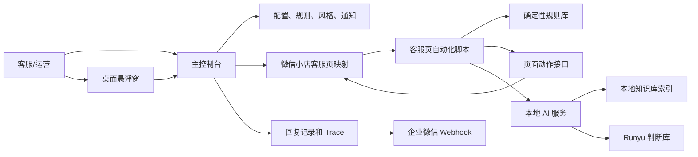
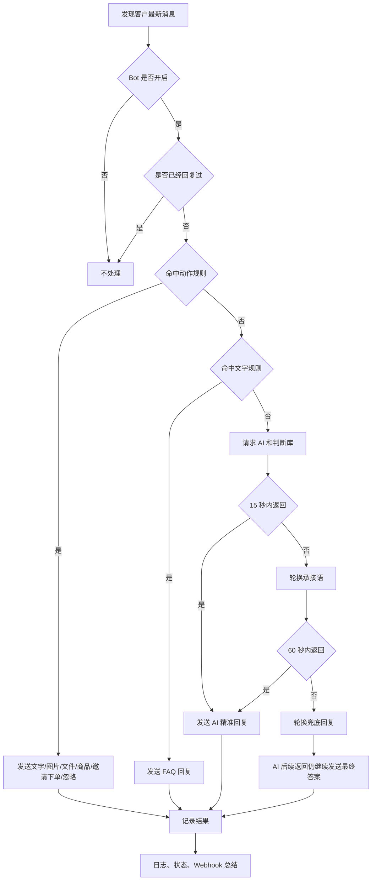

# 小店AI客服

[](https://github.com/JahanHe/wechat-autoreply/actions/workflows/build-installers.yml)
[](https://github.com/JahanHe/wechat-autoreply/releases/tag/v0.3.9)

> README 是这个项目的第一章。先从这里下载、初始化和理解新版能力；需要更细的规则、判断库、Webhook、页面结构、安装疑难和项目历程，再跳到 docs 里的专题文档。

## 当前版本

`v0.3.9` 是一次全栈重构版：以 `v0.3.7` 为功能基线，废弃 `v0.3.8` 的复杂界面方案，保留已经验证有效的安全、退出和运行修复。

| 事项 | 当前状态 |
| --- | --- |
| 应用名称 | 小店AI客服 |
| 交付形态 | macOS DMG、Windows 安装版、Windows 便携版 |
| 首次必填 | DeepSeek API Key、企业微信机器人 Webhook、Runyu 判断库网页登录 |
| 默认能力 | 文字、图片、文件、商品卡片、邀请下单、规则库、AI、判断库、异步第二条回复 |
| 后台运行 | 主窗口关闭只隐藏；Dock、托盘和悬浮窗可恢复；危险区可彻底退出 |
| 敏感信息 | API Key、Webhook、Cookie、控制 Token 只存本机，不进仓库和安装包 |

## 下载

正式安装包在 GitHub Releases，不在 Packages。

| 系统 | 文件 |
| --- | --- |
| macOS Apple Silicon | [xiaodian-ai-kefu-macos-arm64.dmg](https://github.com/JahanHe/wechat-autoreply/releases/download/v0.3.9/xiaodian-ai-kefu-macos-arm64.dmg) |
| Windows 安装版 | [xiaodian-ai-kefu-windows-setup.exe](https://github.com/JahanHe/wechat-autoreply/releases/download/v0.3.9/xiaodian-ai-kefu-windows-setup.exe) |
| Windows 便携版 | [xiaodian-ai-kefu-windows-portable.exe](https://github.com/JahanHe/wechat-autoreply/releases/download/v0.3.9/xiaodian-ai-kefu-windows-portable.exe) |

发布说明：[docs/release-notes/v0.3.9.md](docs/release-notes/v0.3.9.md)

macOS 如果提示“无法验证开发者”，看：[docs/mac-install-troubleshooting.md](docs/mac-install-troubleshooting.md)

## 首次初始化

第一次打开会进入 `系统设置 > 初始化`。换电脑、清空配置或判断库凭证失效时，也会回到这个流程。

| 步骤 | 位置 | 做什么 |
| --- | --- | --- |
| 1 | 系统设置 > 初始化 | 填 DeepSeek API Key |
| 2 | 系统设置 > 初始化 | 填企业微信机器人 Webhook |
| 3 | 系统设置 > 初始化 | 打开 Runyu 登录页，5 分钟内完成网页登录 |
| 4 | 系统设置 > 初始化 | 点“我已登录，获取凭证”，真实查询通过后初始化 10 条引用缓存 |
| 5 | 系统设置 > 初始化 | 点“保存并自检”，检查 AI、Webhook、判断库、规则库和守护状态 |
| 6 | 客服工作台 | 扫码登录微信小店客服页，并选中一个会话 |

初始化完成后，Bot 默认开启。主控台和悬浮窗会同步显示“检测消息、匹配规则、查询判断库、AI思考中、发送文字、发送图片、发送商品、回复失败”等步骤。

## 一张图看懂



## 主控台结构

`v0.3.9` 把旧版很多入口收敛成 4 个一级导航，避免重复和找不到位置。

| 一级入口 | 二级功能 | 用途 |
| --- | --- | --- |
| 客服工作台 | 客服页 | 微信小店客服原网页映射，扫码、选会话、聊天都在这里 |
| 回复中心 | 规则库、Bot策略、API风格、判断库 | 编辑回复规则、开关 Bot、配置 DeepSeek、回复风格、知识库和 Runyu 判断库 |
| 运行监控 | 总览、日志 | 看当前状态、回复来源、AI Trace、判断库命中、Webhook 队列和失败原因 |
| 系统设置 | 初始化、Webhook、悬浮窗、说明 | 首次配置、通知规则、固定悬浮窗、帮助说明和彻底退出 |

界面统一为浅色风格：暖白背景、白色主面板、珊瑚主操作色、语义状态灯、8px 圆角。本地图标随程序打包，不依赖 CDN 或外部网络。

## 悬浮窗和退出逻辑

新版悬浮窗只做状态，不再塞配置表单。

| 项目 | 行为 |
| --- | --- |
| 展开内容 | 当前步骤、AI、本地服务、脚本、登录、实时钟 |
| 操作按钮 | 打开控制台、暂停/开启 Bot |
| 最小化内容 | 当前短状态、实时摘要和状态灯 |
| 最小化按钮 | 打开控制台、展开、关闭悬浮窗 |
| 尺寸 | 展开固定 `344 x 256`，最小化固定 `244 x 52`，不允许无级缩放 |
| 关闭悬浮窗 | 只隐藏，可从主控台、Dock 或托盘重新打开 |
| 关闭主窗口 | 只隐藏控制台，Bot 继续运行 |
| Dock | 应用运行期间保持可见，点击 Dock 图标恢复主控台 |
| 彻底退出 | 系统设置 > 悬浮窗里的危险区，二次确认后停止 Bot、AI、本机控制服务、守护、通知调度和窗口 |

源码安装的 LaunchAgent 只在异常退出时重启，正常彻底退出不会被再次拉起。

## 回复决策流程



关键点：

- 承接语和兜底回复不是最终完成标记。
- 异步第二条 AI 回复不会因为第一条承接语变成“客服最后一条消息”而被取消。
- 去重按会话、客户消息和动作签名判断，避免重复发送固定会员回复。
- 客户发图片、表情、商品卡、文件、视频等非文本消息，不会让脚本失联。

## 默认规则和动作能力

当前默认规则围绕“润宇年度会员商业社群”配置，商品码为 `10000275472384`。

| 客户问题 | 默认动作 |
| --- | --- |
| 想买会员、会员链接、会员入口 | 发送年度会员商品卡片 |
| 怎么买、怎么付款、怎么下单 | 邀请下单 |
| 会员专区包含什么权益、课程目录 | 发送文字和目录图 |
| 怎么进群、会员专区怎么使用 | 发送文字和说明图 |
| 月度会员取消自动续费 | 发送文字和说明图 |
| 咨询俱乐部、产品详情 | 发送文字和详情图 |
| 加微信、留电话、留手机号 | 平台内沟通合规提示 |
| 谢谢、明白、OK | 标记已处理，不再补话 |

可用动作：

| 动作 | 说明 |
| --- | --- |
| `text` | 发送文字 |
| `image` | 上传并发送本地图片，规则卡片显示缩略图 |
| `file` | 上传并发送本地文件 |
| `product` | 发送商品卡片或邀请下单 |
| `material` | 预留素材库动作 |
| `quick_reply` | 预留快捷语动作 |
| `ignore` | 命中后不发送，直接标记已处理 |

图片和文件路径在 `回复中心 > 规则库` 里可以直接编辑，也可以点“选择/替换”换文件，点“打开位置”直达目录。

### 动作规则示例

```json
{
  "enabled": true,
  "name": "会员专区：邀请下单",
  "keywords": ["怎么付款", "怎么买", "怎么购买", "怎么下单", "我要下单"],
  "actions": [
    {
      "type": "text",
      "text": "我给您选好年度会员\n您点进去就可以下单"
    },
    {
      "type": "product",
      "productId": "10000275472384",
      "productName": "润宇年度会员商业社群",
      "button": "邀请下单"
    }
  ]
}
```

## 图片预览

这些默认图片会随安装包复制到本机运行目录，规则库里可以替换。

| 图片 | 用途 |
| --- | --- |
|  | 会员专区使用说明 |
|  | 进群和小程序路径补充 |
|  | 会员权益和目录说明 |
|  | 月度会员取消自动续费 |
|  | 咨询俱乐部详情 |

## AI、知识库和判断库

AI 服务运行在本机，客服页脚本通过白名单 CORS 调用，不再把 API Key 放进命令行参数。

| 模块 | 新版行为 |
| --- | --- |
| DeepSeek | 原生 `fetch`，统一处理超时、HTTP 错误、非 JSON、空回复和脱敏日志 |
| 本地知识库 | 启动时建立内存缓存和倒排索引；文件监听失败时退化为旧的全量搜索 |
| Runyu 判断库 | `fetch` 主线，保留受控 curl 备用线路；记录查询词、来源、命中、耗时、缓存/远程线路和错误码 |
| AI Trace | 记录规则命中、知识库、判断库、Thinking、审核、降级和最终回复来源 |

判断库接入推荐走应用内网页登录：

1. `系统设置 > 初始化` 或 `回复中心 > 判断库` 打开登录网页。
2. 完成网页登录。
3. 点“我已登录，获取凭证”。
4. 程序读取本机 session token，只写入本机 `.env`。
5. 远端真实查询成功后，自动初始化 10 条引用缓存。

常见错误：

| 错误码 | 处理 |
| --- | --- |
| `RUNYU_SESSION_TOKEN_NOT_FOUND` | 登录页未完成，回到登录窗口确认后再获取凭证 |
| `RUNYU_AUTH_EXPIRED` / HTTP 401 | 点“重新登录”，用新 Token 替换旧 Token |
| `RUNYU_PERMISSION_DENIED` / HTTP 403 | 换有判断库权限的账号 |
| `RUNYU_API_404` / HTTP 404 | Base URL 只保留域名 `https://runyuai.zhiduoke.com.cn` |
| `RUNYU_NETWORK_FAILED` / `RUNYU_REQUEST_TIMEOUT` | 检查网络、代理、防火墙后重试 |
| `RUNYU_BOOTSTRAP_EMPTY` | 点“初始化引用库”重试，复制错误码和最近记录反馈 |

## Webhook 通知

企业微信机器人 Webhook 用来把关键事件推给人。

| 通知类型 | 说明 |
| --- | --- |
| 启动和缺配置 | 应用启动、缺 Key、缺 Webhook、缺登录 |
| 扫码和登录 | 需要扫码时通知；登录恢复后通知 |
| 错误和恢复 | AI、判断库、Webhook、客服页、脚本异常会通知；恢复后也会通知 |
| 回复失败 | 页面动作失败、超时、找不到输入框、上传失败 |
| 定时总结 | 每小时总结、每日总览，时间和间隔可配置 |
| 积压补发 | Webhook 失败时写入本地 outbox，恢复后补发 |

二维码截图发送会等待真实二维码出现，避免把“客服页映射已打开”当成二维码发出去。

## 后端和脚本结构

`v0.3.9` 做了结构拆分，但保持原功能基线。

| 层 | 文件或模块 |
| --- | --- |
| Electron 入口 | `desktop/main.js` 只负责启动并导入运行时 |
| 桌面运行时 | `desktop/app-runtime.js` |
| 应用上下文 | `desktop/app-context.js` |
| 状态中心 | `desktop/status-center.js` |
| IPC 契约 | `desktop/ipc-contract.js` |
| 配置校验 | `desktop/config-validator.js` |
| AI 客户端 | `src/deepseek-client.js` |
| 知识库索引 | `src/knowledge-index.js` |
| 文本评分 | `src/text-utils.js` |
| 敏感值脱敏 | `src/redact.js` |
| 客服页源码 | `extension/source/` |
| 客服页产物 | `extension/content.js`，由 esbuild 生成 IIFE |

安装包构建前会自动执行 `npm run build-extension`，避免源码和注入产物不一致。

## 安全边界

- `.env` 不进仓库。
- DeepSeek API Key、Webhook、Runyu Cookie 和本机控制 Token 不进安装包。
- 本机控制接口健康检查可只读访问；写操作必须带随机 Token。
- AI 服务 CORS 允许微信小店客服域名和本机控制来源，不使用无限制通配。
- 日志、Webhook 和诊断复制内容会脱敏。
- 不绕过微信扫码、验证码或平台风控。
- 严禁引导客户加微信、打电话、私聊、留手机号或私下交易。

## 本地运行

```bash
npm install
npm run desktop
```

常用检查：

```bash
npm run build-extension
npm run test:baseline
npm run test:desktop-modules
npm run test:ai-knowledge
npm run test:security-config
npm run test:extension-modules
npm run test:lifecycle
npm run test:status-ui
npm run test:regressions
npm run test:notify-outbox
npm run check:secrets
npm run doctor
npm run test:release-readiness
```

打包：

```bash
npm run dist:mac
npm run dist:win
```

## 运行目录

| 内容 | 仓库默认文件 | 运行时文件 |
| --- | --- | --- |
| 默认回复规则 | `config/replies.json` | `desktop-config.json` |
| 回复图片 | `config/reply-images/` | `config/reply-images/` |
| 助手风格和知识库 | `config/assistant-profile.json` | `assistant-profile.json` |
| FAQ 知识库 | `knowledge-base/customer-service.md` | 随安装包读取 |
| API Key / Webhook / Cookie / Token | 不进仓库 | `.env` |

macOS：

```text
~/Library/Application Support/小店AI客服/
```

Windows：

```text
%APPDATA%/小店AI客服/
```

## 发布流程

GitHub Actions 工作流：[.github/workflows/build-installers.yml](.github/workflows/build-installers.yml)

| 触发 | 行为 |
| --- | --- |
| 推送 `main` | 运行无头门禁并构建 macOS/Windows artifacts |
| 推送 `v*` 标签 | 构建 macOS DMG、Windows 安装版、Windows 便携版，并创建 GitHub Release |
| Release Notes | 优先读取 `docs/release-notes/<tag>.md` |
| 资产名 | `xiaodian-ai-kefu-macos-arm64.dmg`、`xiaodian-ai-kefu-windows-setup.exe`、`xiaodian-ai-kefu-windows-portable.exe` |

`v0.3.8` 已恢复为历史说明并标记废弃，不再作为推荐版本。

## 验收状态

本地已通过：

- 行为基线：文字、图片、文件、商品、邀请下单、规则、AI、判断库、异步回复、Webhook、窗口生命周期
- 桌面模块、AI/知识库、安全配置、扩展模块、生命周期、状态 UI、核心回归、通知补发、密钥扫描、doctor、release-readiness
- macOS 本地 DMG 生成、挂载检查、asar 资源检查和打包 `.app` 临时用户目录启动烟测

仍需要在真实微信小店会话中复核的动作：

- 文字规则、AI 直接回复、判断库深度回复、15 秒承接、60 秒兜底
- 客户图片、表情、商品卡、文件和视频消息识别
- 发送图片、文件、商品卡片和邀请下单
- 登录过期、判断库 Cookie 过期、AI 失败、Webhook 失败和恢复通知

## 文档路由

| 你想做什么 | 直接看 |
| --- | --- |
| 按图文说明安装、配置 API、Webhook、规则和图片 | [docs/rich-user-guide.md](docs/rich-user-guide.md) |
| macOS 提示无法打开、开发者无法验证、xattr 命令 | [docs/mac-install-troubleshooting.md](docs/mac-install-troubleshooting.md) |
| 写自己的回复规则：什么时候发文字、图片、商品、邀请下单 | [docs/customer-reply-rule-library.md](docs/customer-reply-rule-library.md) |
| 理解桌面版怎么运行、运行目录在哪里、Webhook 怎么汇总 | [docs/desktop-app-structure-deployment.md](docs/desktop-app-structure-deployment.md) |
| 理解微信小店客服页结构，后续控制商品、素材库、快捷语 | [docs/wechat-kf-page-structure.md](docs/wechat-kf-page-structure.md) |
| 看懂检测、AI、文字、图片、商品和异常指示灯 | [docs/runtime-statuses.md](docs/runtime-statuses.md) |
| 看项目从浏览器脚本到桌面安装包的完整历程 | [docs/project-journey.md](docs/project-journey.md) |
| 查看当前发行版说明 | [docs/release-notes/v0.3.9.md](docs/release-notes/v0.3.9.md) |
| 查看废弃的 v0.3.8 说明 | [docs/release-notes/v0.3.8.md](docs/release-notes/v0.3.8.md) |
