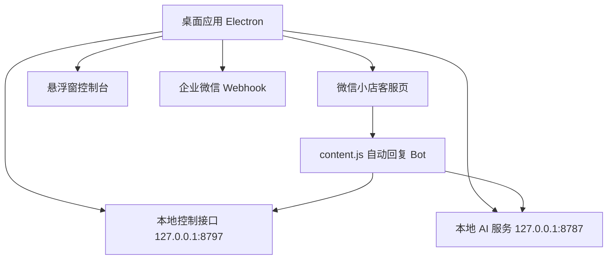

# 微信小店客服自动回复桌面版结构和部署说明

## 目录结构

```text
WeChat-chat/
  desktop/
    main.js                 桌面主进程、窗口、Webhook、页面动作、本地控制接口
    floating.html           悬浮窗界面
    floating.js             悬浮窗设置逻辑
    preload.cjs             微信小店页面和桌面主进程通信桥
    floating-preload.cjs    悬浮窗和桌面主进程通信桥
  extension/
    content.js              注入微信小店客服页的自动回复 Bot
  config/
    replies.json            默认文字规则、动作规则、图片规则
    assistant-profile.json  AI 风格、知识库、边界、审核提示词
    quick-replies.json      本地承接语，默认只保留“在”
    waiting-replies.json    AI 慢回复等待语
    reply-images/           打包随带的规则图片
  knowledge-base/
    customer-service.md     FAQ 知识库
  server.js                 本地 AI 服务
  package.json              Electron 打包配置
  docs/                     规则和部署说明
```

## 运行结构



## 回复决策顺序

1. 先检查 Bot 是否开启。
2. 只处理当前会话里最新的客户消息。
3. 如果最后一条是客服自己发的，不回复。
4. 同一条客户消息已经回复过，不重复回复。
5. 先匹配动作规则 `actionRules`。
6. 再匹配独立图片规则 `imageReplies`。
7. 再匹配文字规则 `rules`。
8. 都没有命中时，先发承接语“在”，再调用本地 AI。
9. AI 只做兜底，不覆盖确定性规则。

## 当前回复约束

- 对客户统一使用“您”。
- 默认承接语只发“在”。
- 文字回复最多发送两条。
- 每条文字可以较长，不按 15 字拆碎。
- 不说“我帮您核对”“我确认一下”“我查一下”“我处理一下”。
- 不承诺订单、物流、退款、权限、价格结果。
- 不引导加微信、打电话、留手机号、私聊或离开平台。
- 客户只是道谢、明白、OK 时，不再回复。

## 页面动作能力

`desktop/main.js` 通过 `runPageAction()` 暴露页面动作：

- `text` / `send_text`：发送文字
- `image`：上传并发送图片
- `file`：上传并发送文件
- `product`：根据商品码发送商品卡片或邀请下单
- `material`：发送素材库内容
- `quick_reply`：发送后台快捷回复
- `ignore`：不发送，标记已处理
- `capture_structure`：捕捉页面结构
- `open_float`：打开悬浮窗

当前默认规则只使用：文字、图片、商品、邀请下单、忽略。文件、素材库、快捷回复先不写默认规则。

## Webhook 通知规则

企业微信机器人地址在悬浮窗设置 -> 通知里配置。

默认行为：

- 程序启动时通知一次。
- 每分钟检查本地 AI 服务、客服页、Bot 心跳。
- 正常健康检查不发通知。
- 只有异常时立即通知。
- 登录页出现二维码时，等待二维码渲染后截图并发送。
- 回复失败、图片/文件缺失、AI 异常、页面崩溃、页面跑偏、Bot 长时间无状态，会即时通知。
- 成功回复不会逐条刷 webhook。
- 每小时发送一次自动回复总结。
- 每天上午 10 点发送昨日自动回复总览。

通知补发：

- 企业微信发送失败时进入 `notify-outbox.json`。
- 程序每分钟尝试补发。
- 图片登录截图失败时也会进入补发队列。

回复记录：

- 成功、失败、超时都会进入 `reply-records.json`。
- 小时总结和每日总结从这里汇总。

## API 接入规则

本地 AI 服务默认监听：

```text
http://127.0.0.1:8787
```

接口：

```text
GET  /health
POST /reply
POST /quick-reply
POST /waiting-reply
POST /knowledge/search
```

API 配置来自 `.env`：

```text
DEEPSEEK_API_KEY=你的 key
DEEPSEEK_MODEL=deepseek-v4-flash
DEEPSEEK_BASE_URL=https://api.deepseek.com
DEEPSEEK_THINKING=enabled
DEEPSEEK_REASONING_EFFORT=medium
DEEPSEEK_REVIEW=enabled
```

打包后 `.env` 和运行配置在当前用户目录：

```text
~/Library/Application Support/wechat-shop-kf-bot/
```

Windows 对应目录：

```text
%APPDATA%/wechat-shop-kf-bot/
```

## 新电脑部署

macOS：

1. 安装 `微信小店客服自动回复.dmg`。
2. 把 App 拖到 Applications。
3. 第一次打开后，在悬浮窗 -> API 填 DeepSeek API Key。
4. 在悬浮窗 -> 通知 填企业微信机器人 Webhook。
5. 登录微信小店客服页。
6. 悬浮窗显示“接管开启”后即可运行。

Windows：

1. 运行 Windows 安装包或 portable 版本。
2. 第一次打开后，在悬浮窗 -> API 填 DeepSeek API Key。
3. 在悬浮窗 -> 通知 填企业微信机器人 Webhook。
4. 登录微信小店客服页。
5. 悬浮窗显示“接管开启”后即可运行。

## 迁移配置

要把一台电脑的配置复制到另一台电脑，复制运行目录里的这些文件：

```text
desktop-config.json
assistant-profile.json
.env
config/reply-images/
reply-records.json      可选，历史汇总记录
notify-outbox.json      可选，未补发通知队列
```

macOS 运行目录：

```text
~/Library/Application Support/wechat-shop-kf-bot/
```

Windows 运行目录：

```text
%APPDATA%/wechat-shop-kf-bot/
```

## 关闭规则

悬浮窗就是在线回复程序的控制台。

- 点击悬浮窗顶部“关闭”会进入彻底关闭确认。
- 点击“彻底关闭”需要 8 秒内点第二次。
- 彻底关闭后会停止自动回复、Webhook、悬浮窗和本地 AI 服务。
- 重新双击应用才会恢复。

## 构建命令

安装依赖：

```bash
npm install
```

构建 mac：

```bash
npm run dist:mac
```

构建 Windows：

```bash
npm run dist:win
```

构建产物在：

```text
dist/
```

## GitHub Actions 构建

仓库已配置：

```text
.github/workflows/build-installers.yml
```

触发方式：

- 推送到 `main` 或 `master`
- 在 GitHub Actions 页面手动点 `Run workflow`

产物：

- `wechat-autoreply-macos`：macOS DMG
- `wechat-autoreply-windows`：Windows 安装包和 portable 包

GitHub Actions 不需要 DeepSeek API Key 和企业微信 Webhook。API Key 和 Webhook 是运行时配置，用户第一次打开应用后在悬浮窗里填写。
