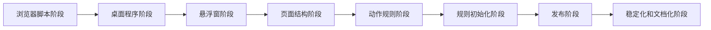
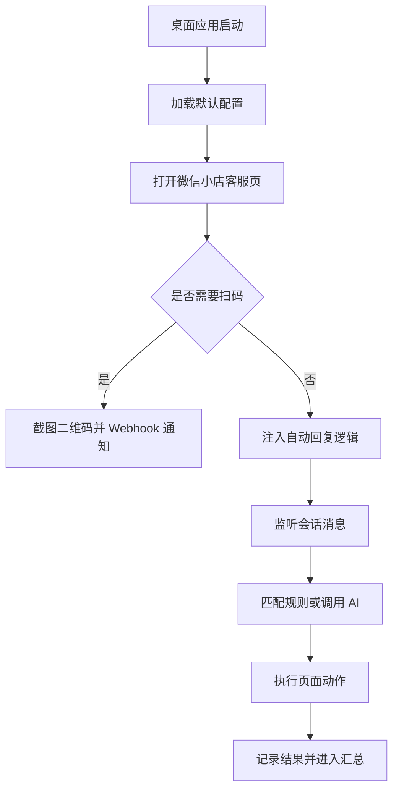
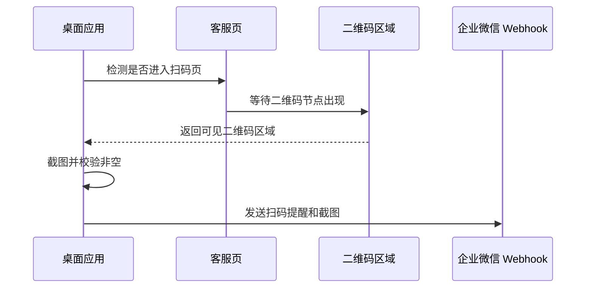
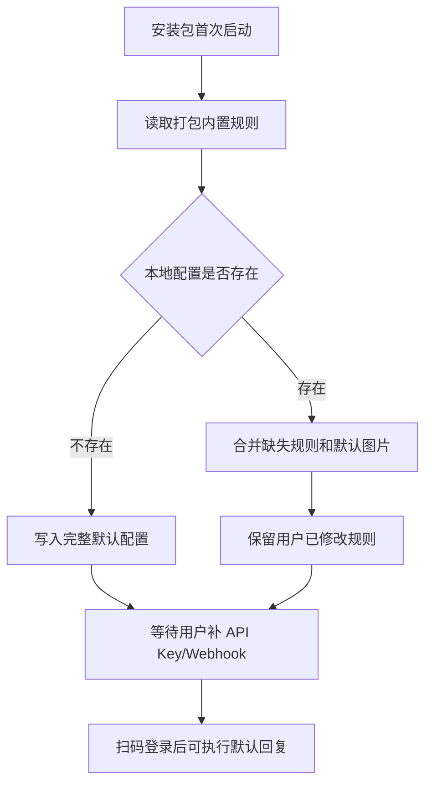
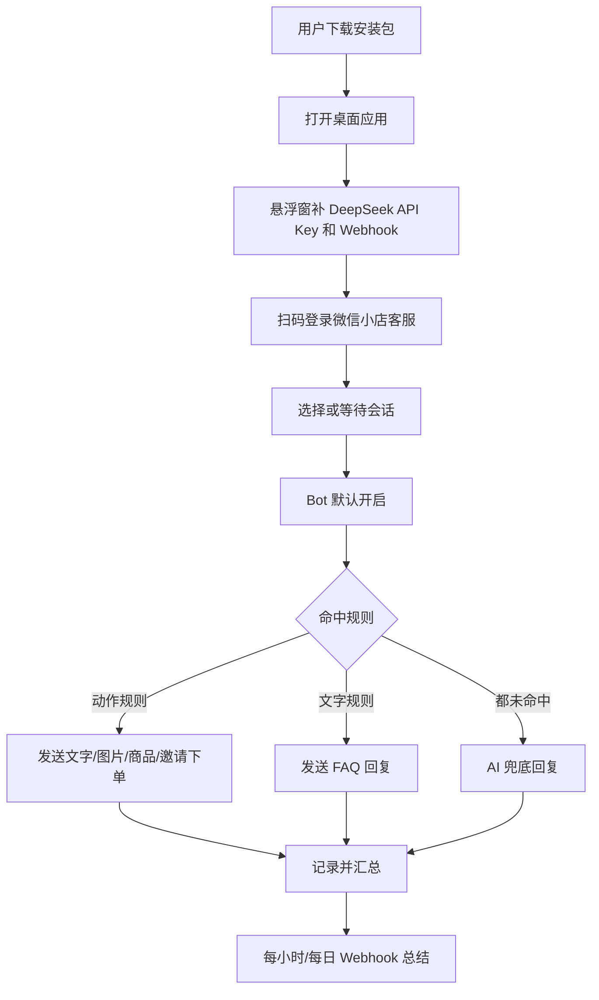
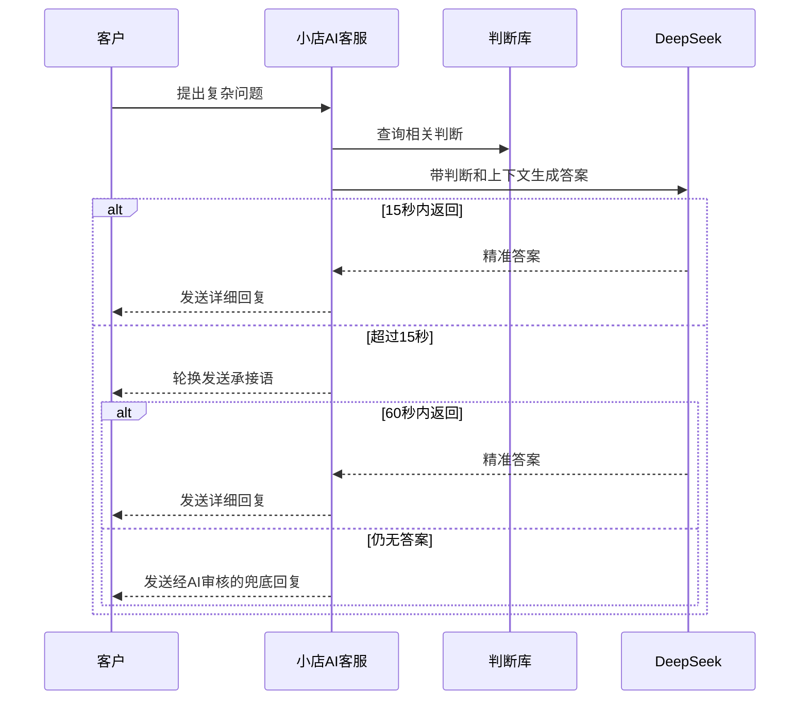
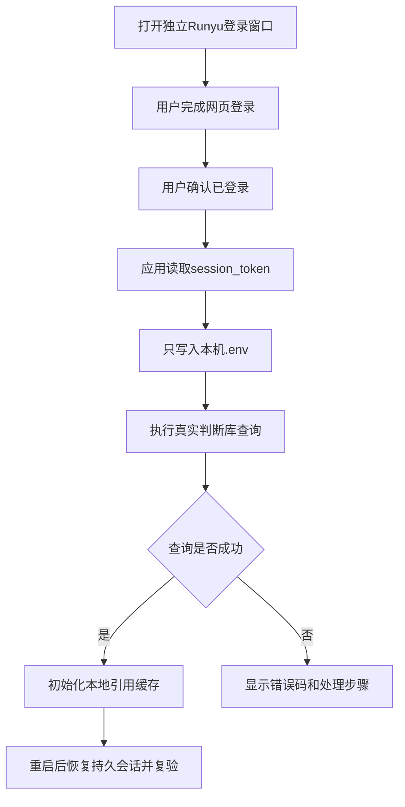
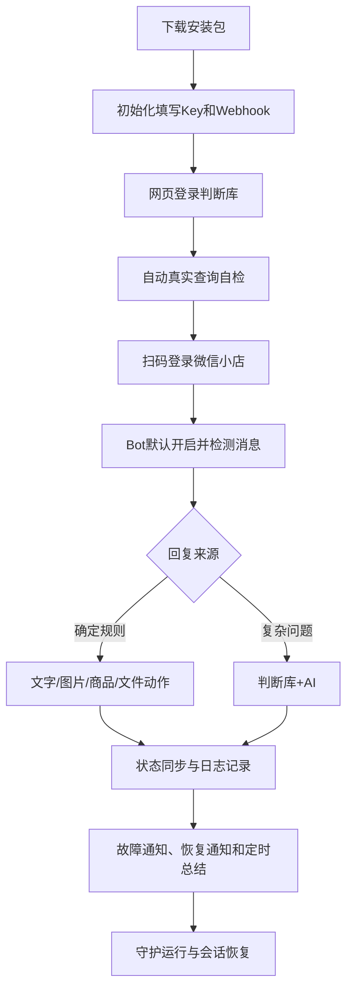

# 小店AI客服项目历程：从浏览器依赖到桌面工作台

> 这个项目的主线不是“写一个会聊天的机器人”，而是把一个容易被关掉、容易漏配、容易丢规则的浏览器自动化工具，推进成一个可以下载安装、扫码登录、补 Key 后长期运行的桌面客服工作台。

## 证据来源

这份历程文档根据这些项目材料整理：

| 来源 | 内容 |
| --- | --- |
| Git 历史 | 从初始提交到 `v0.1.0` 发布、再到 `d3d989c` 文档化提交的关键节点 |
| 本地文档 | `README.md`、`docs/customer-reply-rule-library.md`、`docs/wechat-kf-page-structure.md` |
| 规则资产 | `config/replies.json`、`config/reply-images/`、`config/assistant-profile.json` |
| 页面探索 | 微信小店客服页结构捕捉、商品面板、素材库、快捷语、上传弹窗 |
| 发布产物 | GitHub Release `v0.1.0` 的 macOS DMG 和 Windows EXE |

## 时间线



## 第一幕：普通世界

最早的问题很朴素：客服自动回复工具必须依赖浏览器页面。浏览器标签页一关、页面刷新、电脑休眠、扫码掉线，自动回复就可能停掉。

当时工具的核心能力是“能回复”，但还不是“能值守”。这两个目标差别很大：

| 只会回复 | 能够值守 |
| --- | --- |
| 需要人工盯浏览器 | 桌面应用自己打开客服页 |
| 配置分散在文件里 | 悬浮窗集中管理 |
| 失败后不一定知道 | Webhook 主动通知 |
| 换电脑容易漏文件 | 安装包自动初始化 |
| 规则靠记忆维护 | 规则库有格式、有校验、有文档 |

于是项目的真正目标被定下来：不是替代客服，而是让机器人在平台规则允许的范围内，稳定接住高频问题，把人从重复回复里解放出来。

## 第二幕：召唤

用户明确提出了几个硬要求：

| 要求 | 背后的真实问题 |
| --- | --- |
| 独立程序 | 不想再依赖手动打开浏览器 |
| 持续运行 | 不能因为页面被关掉就停止接待 |
| 桌面悬浮窗 | 隐藏后要找得到，状态要看得见 |
| Webhook 通知 | 需要扫码、崩溃、失败时要主动提醒 |
| 图片回复 | FAQ 里很多答案必须配图才讲得清 |
| 商品卡片/邀请下单 | 客服目标不是闲聊，而是把客户引导到正确商品 |
| 规则库 | 后续要自己写“什么时候发什么” |
| 默认安装可用 | 下载后只补 API Key 和 Webhook，不应重新手工搭环境 |

这一步把项目从“脚本”推向“产品”。脚本只要跑通一次，产品要让下一次、下一台电脑、下一个安装包都跑通。

## 第三幕：跨过门槛

第一次关键转折是桌面化。

`de19310 Build desktop WeChat autoreply app` 把项目推进到 Electron 桌面应用：客服页被放进应用窗口，本地 AI 服务、悬浮窗、Webhook、守护脚本开始成为一个整体。



这一版解决了“浏览器容易被关掉”的主问题，但也暴露了第二层问题：桌面应用如果没有配置入口，使用者仍然要翻文件。

## 第四幕：试炼

### 试炼一：悬浮窗不只是状态灯

悬浮窗最初只是为了显示程序还活着。后来它被要求承担更多工作：

| 模块 | 必须能做什么 |
| --- | --- |
| 状态 | 显示客服页、Bot、AI 服务、通知状态 |
| 开关 | 默认开启，可手动暂停，可彻底关闭 |
| API | 配置 DeepSeek API Key |
| 通知 | 配置并测试企业微信 Webhook |
| 回复 | 编辑文字规则、图片规则、动作规则 |
| 助手 | 配置知识库、参考回复、语气、风格、边界 |
| 页面 | 捕捉当前客服页结构，方便后续规则迭代 |

“隐藏后找不到”的问题也改变了设计方向：桌面程序不能只有一个窗口，它需要在菜单、托盘或系统入口里重新唤起悬浮窗。

### 试炼二：二维码不能抢跑

Webhook 发送二维码截图时，不能页面一跳到扫码页就立刻截图。二维码渲染有延迟，太早截图会发出空白或半成品。

因此逻辑变成：



这一步把通知从“能发”推进到“发对”。

### 试炼三：页面动作不能靠猜

要发送商品、图片、文件、快捷语、素材库内容，必须知道微信小店客服页的结构。项目捕捉并整理了关键区域：

| 页面能力 | 自动化入口 |
| --- | --- |
| 输入框 | 文本发送、等待语、AI 兜底 |
| 上传按钮 | 图片和文件发送 |
| 商品标签 | 商品卡片、邀请下单 |
| 素材库标签 | 后续素材库内容发送 |
| 快捷语标签 | 后台快捷回复发送 |
| 二次弹窗 | 自动确认、等待结果 |

这里有一个重要边界：当前默认规则已经配置了文字、图片、商品卡片和邀请下单；素材库和快捷语的动作接口已经预留，但默认业务规则没有强行启用素材库内容，避免在没有明确规则时误发。

## 第五幕：深入洞穴

真正难的不是“写几条规则”，而是让规则在安装包里不会丢。

用户指出：测试时能发图片和商品，不代表正式打包后下载下来也能用。正式版本必须做到：

- 内置默认 FAQ 规则。
- 内置配套图片。
- 首次运行自动写入运行目录。
- 旧版本升级时补齐新规则。
- 用户已经手改过的同名规则不能被覆盖。
- API Key 和 Webhook 不能进仓库、不能进安装包。

`438f14a Ensure packaged app initializes default rules` 正是为了解这个问题。



这一步的意义很直接：下载版本不是一个空壳，而是一个带业务规则和图片资产的可运行版本。

## 第六幕：拿到宝物

项目最终沉淀出三类“宝物”。

### 1. 可读的规则库

规则库把“什么时候发什么”变成标准结构：

```json
{
  "enabled": true,
  "name": "会员专区：商品卡片",
  "keywords": ["年度会员", "会员链接", "会员入口"],
  "actions": [
    {
      "type": "text",
      "text": "这是润宇年度会员商业社群，您可以点商品卡片查看详情。"
    },
    {
      "type": "product",
      "productId": "10000275472384",
      "productName": "润宇年度会员商业社群",
      "button": "发商品"
    }
  ]
}
```

### 2. 可扩展的动作接口

| 动作 | 当前用途 |
| --- | --- |
| `text` | 发送文字 |
| `image` | 发送本地图片 |
| `file` | 发送文件 |
| `product` | 发商品卡片或邀请下单 |
| `material` | 预留素材库内容发送 |
| `quick_reply` | 预留后台快捷语发送 |
| `ignore` | 命中后不再回复 |

### 3. 可下载的安装包

`6bb9920 Publish releases for version tags` 和 `8ad9c46 Fix release workflow notes syntax` 让 GitHub Actions 在版本标签发布时自动上传安装包。

当前 Release：

- [v0.3.6 发布页](https://github.com/JahanHe/wechat-autoreply/releases/tag/v0.3.6)
- [macOS Apple Silicon DMG](https://github.com/JahanHe/wechat-autoreply/releases/download/v0.3.6/wechat-autoreply-macos-arm64.dmg)
- [Windows 安装版](https://github.com/JahanHe/wechat-autoreply/releases/download/v0.3.6/wechat-autoreply-windows-setup.exe)
- [Windows 便携版](https://github.com/JahanHe/wechat-autoreply/releases/download/v0.3.6/wechat-autoreply-windows-portable.exe)

## 第七幕：带着答案回来

最终，项目从“能回复”变成了“可交付”：

| 阶段 | 代表提交 | 结果 |
| --- | --- | --- |
| 初始化 | `e111c49` | 建立基础项目 |
| 桌面化 | `de19310` | Electron 桌面应用、悬浮窗、Webhook、AI 服务 |
| CI 修复 | `d233e76` | Windows/macOS 构建链路跑通 |
| 发布收敛 | `581a89a` | 避免 main 每次自动发布 |
| 稳定运行 | `31c14b2` | 固定 Electron 版本，降低运行崩溃风险 |
| 默认规则 | `438f14a` | 安装包首次运行自动初始化规则和图片 |
| Release | `6bb9920` | 标签触发正式 Release 上传 |
| 语法修复 | `8ad9c46` | 修复 Release Notes 工作流语法 |
| 文档化 | `d3d989c` | 增加富文本使用说明和项目历程 |

## 项目现在的运行逻辑



## 仍然保留的边界

这个项目不会绕过平台登录、验证码或风控。需要人工扫码时，它会通知；页面结构变化时，它会捕捉结构并暴露接口；Webhook 和 API Key 必须由使用者自己配置，不能提交到仓库或打进安装包。

这也是整个项目最重要的工程原则：自动化是为了稳定完成客服动作，不是为了绕开平台边界。

## 下一步演进

| 方向 | 目标 |
| --- | --- |
| 规则编辑器可视化 | 把 JSON 规则变成表单式编辑 |
| 规则命中回放 | 查看某条客户消息为什么命中某条规则 |
| 商品库同步 | 从页面或后台导出商品码，减少手填 |
| 素材库规则 | 在确认素材名称和业务场景后启用默认素材规则 |
| 签名发布 | 接入 macOS/Windows 代码签名，减少系统安全提示 |

这个项目走到 `v0.1.0`，最核心的胜利不是“机器人会说话”，而是：下载、配置、扫码、回复、通知、升级，这条链路已经被连起来了。这是第一段英雄之旅的终点，也是第二段旅程的起点。

---

# 第二部：从可交付到可值守

> 第一部解决“能不能做成安装包”，第二部解决“安装到另一台电脑以后，能不能真的长期值守、准确回复、自动恢复，并把每一步展示清楚”。

## 第二段证据来源

| 来源 | 内容 |
| --- | --- |
| 版本标签 | `v0.1.0` 到 `v0.3.7` 的连续发行记录 |
| 关键提交 | 控制台、判断库、安装修复、长期运行、Cookie 修复、自动登录和统一状态机 |
| 跨电脑反馈 | 另一台 Mac 缺少模块、未签名应用被拦截、Cookie 导入 404、规则和图片动作未初始化 |
| 真实验证 | 图片、文件、商品卡片、邀请下单、Runyu 真实查询、重启恢复和状态 UI 自动化测试 |
| 产品要求 | 初始化向导、可视化配置、浅色界面、详细状态、Webhook 故障与恢复通知 |

## 版本长路

```mermaid
flowchart LR
  V1["v0.1.0 可安装"] --> V2["v0.2.0 主控制台"]
  V2 --> V30["v0.3.0 判断库与规则动作"]
  V30 --> V31["v0.3.1 跨电脑安装修复"]
  V31 --> V32["v0.3.2 初始化与长期运行"]
  V32 --> V33["v0.3.3 接口与恢复通知"]
  V33 --> V34["v0.3.4 自动登录判断库"]
  V34 --> V35["v0.3.5 全过程状态机"]
  V35 --> V36["v0.3.6 登录与发送闭环"]
  V36 --> V37["v0.3.7 非文本与规则试跑"]
```



## 第一阶段：新的普通世界

`v0.1.0` 已经有 DMG、Windows EXE、默认规则、悬浮窗和 Webhook。看起来旅程已经结束，但真正安装和使用以后，新的问题出现了：

- 所有复杂配置都挤在悬浮窗里。
- 悬浮窗关闭后不容易重新找到。
- 测试电脑能发送，不等于安装包在另一台电脑也能发送。
- 规则、图片、商品码和判断库凭证可能只存在于开发环境。
- 页面动作成功以后，用户看不到程序究竟执行到哪一步。

新的普通世界不再是“浏览器会被关掉”，而是“桌面程序已经存在，但还没有达到可以放心交给别人使用的程度”。

## 第二阶段：再次召唤

第二次召唤来自一个更严格的标准：安装包下载后，除了 Key、Webhook 和必要登录，其他能力都应该自动准备好。

这意味着产品必须同时回答五个问题：

| 问题 | 必须给出的答案 |
| --- | --- |
| 在哪里配置？ | 主控制台提供可视化入口和保存状态 |
| 为什么没有回复？ | 日志和状态显示命中来源、处理阶段和失败原因 |
| 换电脑为什么失效？ | 安装包包含完整模块、规则、图片和初始化逻辑 |
| 判断库怎么长期接入？ | 每台电脑网页登录一次，自动保存和恢复本机会话 |
| 程序现在在做什么？ | 主控制台和悬浮窗同步展示全过程状态 |

## 第三阶段：拒绝召唤的假胜利

这一阶段最危险的不是完全不能用，而是“开发机上看起来能用”。

图片发送、商品卡片和邀请下单曾经在真实页面测试成功，但新安装版本里仍可能因为运行目录没有图片、默认规则没有合并、页面动作配置没有迁移而失效。Runyu 判断库也曾出现 Cookie 已填写却返回 404 的情况。另一台 Mac 甚至直接报错：

```text
Cannot find module ... app.asar/src/runyu-judgments.js
```

这些问题揭示了一个工程事实：一次成功截图不是产品能力，只有源码、安装包、运行目录、另一台电脑和升级路径都通过，才算正式能力。

## 第四阶段：遇见导师

第二部的“导师”不是某个人，而是一套更严格的验证方法：以真实页面结构、真实安装包和真实接口返回为准。

项目开始坚持这些原则：

1. 页面动作先在微信小店真实会话验证，再进入默认规则。
2. 运行配置不能只看仓库文件，要检查首次启动后的用户目录。
3. 判断库不能只看 Cookie 已保存，必须执行真实查询后才显示已连接。
4. 故障修复不能只停止报错，还要通过 Webhook 发出“已恢复”。
5. UI 不能只看代码尺寸，要用截图和溢出检测验证展开、最小化状态。

从这里开始，“功能存在”的定义发生了变化：不是代码里有函数，而是用户能配置、能看到、能运行、能排查、能恢复。

## 第五阶段：跨过第二道门槛

`v0.2.0` 的主控制台是第二次关键转折。悬浮窗不再承担全部配置，而是回到“持续显示状态”的职责；主控制台成为正式操作中心。

| 控制台页面 | 解决的问题 |
| --- | --- |
| 客服页映射 | 保留原微信小店聊天界面和登录流程 |
| 总览状态 | 集中查看 Bot、AI、Webhook、页面和回复记录 |
| Bot 接管 | 控制自动回复、节奏、承接和兜底 |
| API 接入 | 保存并测试 DeepSeek 配置、风格和知识库 |
| Webhook | 配置故障通知、小时总结和每日总览 |
| 规则库 | 可视化编辑文字、图片、商品、文件和忽略动作 |
| 日志库 | 区分规则回复、直接回复、AI 和判断库来源 |
| 悬浮窗 | 重新打开、置顶、最小化和隐藏 |

这一步让应用第一次有了清晰的前台、后台和桌面状态入口。

## 第六阶段：试炼、盟友与敌人

`v0.3.0` 面对的是回复准确度和业务动作的组合试炼。

### 判断库成为盟友

复杂问题不能只靠关键词固定回复。项目接入 Runyu 判断库，并形成两段式回复策略：



### 重复回复成为敌人

“会员专区有视频回放、社群和专区问答”如果重复发送，会让客户感到机器人失控。因此新增会话级回复记忆，相同话术已经发过就进入 `跳过重复`，不再机械复读。

### 文件路径成为可操作对象

图片和文件规则不再只显示路径。控制台增加“选择/替换”和“打开位置”，让运营人员可以直接更换素材，而不是手工寻找配置文件。

## 第七阶段：逼近深渊

`v0.3.1` 暴露了最直接的交付失败：开发机正常，另一台 Mac 启动即崩溃。原因是 `src/runyu-judgments.js` 没有进入 `app.asar`。

修复不仅是把一个文件加回安装包，还包括：

- 将 `src/**/*` 和 `docs/**/*` 纳入构建。
- 在 DMG 中附带 macOS 安装疑难说明。
- 说明未签名应用如何右键打开或清除隔离属性。
- 构建后主动检查 `app.asar` 是否包含判断库模块。

这一关让“构建成功”升级成“安装包内容完整并能在另一台电脑启动”。

## 第八阶段：严峻考验与蜕变

`v0.3.2` 将零散修复重新组织成完整的产品身份和初始化流程。

| 蜕变 | 结果 |
| --- | --- |
| 统一名称 | 应用、窗口、托盘、安装包和运行目录全部改为“小店AI客服” |
| 统一图标 | App、DMG、Windows、托盘和控制台使用正式图标 |
| 初始化向导 | 首次打开先配置 Key、Webhook 和判断库，再执行安全自检 |
| 长期运行 | 增加开机自启、脚本心跳、防休眠和异常重载 |
| 旧配置迁移 | 自动读取旧运行目录，避免升级后规则和配置丢失 |

这次蜕变把“需要技术人员安装”推进成“普通使用者可以按步骤完成初始化”。

## 第九阶段：获得奖赏

`v0.3.3` 解决了判断库接口和运维通知的闭环。

- Base URL 即使误粘完整接口路径，也会自动规整为域名。
- Cookie 支持裸 token、`session_token=...` 和完整 Cookie 字符串。
- 网络异常时增加与接入文档一致的备用请求线路。
- `401`、`403`、`404` 被区分为登录过期、权限不足和地址/网络问题。
- AI、判断库、客服页、脚本和通知通道恢复后，会补发“已恢复”通知。
- 客服页右下角旧版工具条被移除，避免与主控制台重复和冲突。

奖赏不是“永远不出错”，而是出错以后能知道原因，恢复以后也能确认已经恢复。

## 第十阶段：返回之路

手工复制 Cookie 仍然不适合在多台电脑长期使用。`v0.3.4` 因此把判断库接入改成应用内网页登录：



本机真实测试查询“会员”返回 94 条记录。关闭应用再启动，没有再次要求登录，持久会话恢复后真实查询仍然成功。

## 第十一阶段：复活

到 `v0.3.5`，最后一个明显盲区是：Bot 虽然在工作，但使用者只看到“开启”或“暂停”，看不到思考和执行过程。

项目新增统一运行状态机，把全过程拆成 42 个正式状态，短状态全部不超过 6 个字符：

| 阶段 | 代表状态 |
| --- | --- |
| 检测 | `检测中`、`检测消息`、`已检测消息`、`客服最后` |
| 匹配 | `匹配规则`、`匹配图片`、`匹配商品` |
| AI | `收集上下文`、`查询判断库`、`AI思考中`、`AI已返回` |
| 发送 | `发送文字`、`发送图片`、`发送商品`、`邀请下单` |
| 完成 | `文字已发`、`图片已发`、`商品已发`、`已邀下单` |
| 控制 | `暂停中`、`跳过重复`、`已忽略` |
| 异常 | `回复超时`、`回复失败`、`待扫码` |

主控制台显示当前步骤和最近 6 个步骤；展开悬浮窗显示当前步骤、详细说明、四类健康灯和最近 3 个步骤；最小化悬浮窗只显示指示灯和当前短状态。

脚本心跳也与业务状态拆开：`AI思考中` 或 `发送图片` 不会再被误认为脚本异常。自动化测试依次模拟 14 个关键状态，通过正式 IPC 状态机验证双窗口同步、六字限制和窗口无溢出。

## 第十二阶段：把登录和发送做成闭环

`v0.3.6` 继续追查两个“看起来完成、实际上会中断”的问题。

第一个问题是 Cookie 已保存不代表远端接口可用。旧逻辑可能命中本地缓存后显示连接成功，换电脑或 Token 过期时无法解释失败。新版把接入拆成打开页面、确认登录、捕捉凭证、远端验证和初始化引用库五个可见阶段，并增加 5 分钟倒计时、周期自检、错误码、最近凭证记录以及故障/恢复 Webhook。真实测试也因此准确识别出旧 Token 已过期，而不是继续误报成功。

第二个问题是异步回复和页面动作的完成条件。15 秒承接语、60 秒兜底回复现在只负责告诉客户“正在处理”，不会把任务标记为最终完成；即使最后一条消息已经是客服发出的承接语，AI 后续答案仍会继续发送。图片动作同时改为识别微信客服页隐藏的 `collab-file1-*` 输入框，并等待预览或发送状态变化后才记录成功。

| 闭环 | 新的完成标准 |
| --- | --- |
| Cookie | 远端真实查询成功，不能由本地缓存代替 |
| 首次接入 | 查询成功后本地至少有可引用记录 |
| 故障排查 | 页面展示错误码、HTTP 状态、原因、下一步和历史记录 |
| 异步回复 | 承接/兜底之后，最终 AI 答案仍可继续发送 |
| 图片动作 | 找到真实输入框，并检测到上传预览或发送状态变化 |

## 第十三阶段：携带灵药归来

第二段英雄之旅带回来的“灵药”，是一套可以复制到其他电脑的运行闭环：



使用者现在不需要理解 Electron、Cookie 拼接、图片目录或页面选择器。第一次使用只需要完成本机配置和两次必要登录，之后可以从状态、日志和 Webhook 中知道程序是否正常。

## 第二部版本表

| 版本 | 代表提交 | 带回来的能力 |
| --- | --- | --- |
| `v0.1.0` | `438f14a` | 安装包首次运行初始化默认规则和图片 |
| `v0.2.0` | `3e97bfe` | 主控制台、客服页映射、日志和可视化配置 |
| `v0.3.0` | `a262548` | 判断库、两段式 AI、规则动作、浅色界面和素材路径操作 |
| `v0.3.1` | `fb1690e` | 修复跨电脑缺模块，DMG 附带安装疑难说明 |
| `v0.3.2` | `66c53b1` | 统一应用名和图标、初始化向导、开机自启和防后台清退 |
| `v0.3.3` | `c0c097d` | Cookie/Base URL 修复、故障和恢复通知闭环 |
| `v0.3.4` | `bfe0e11` | 判断库网页登录、自动取凭证、真实查询和重启恢复 |
| `v0.3.5` | `4258bc3` | 42 个详细状态、双窗口同步、脚本心跳和状态 UI 自动化测试 |
| `v0.3.6` | 已发布 | Cookie 引导、自检追溯、异步最终回复和图片发送确认闭环 |
| `v0.3.7` | 已发布 | 非文本消息兜底、规则手动激发测试、AI 判断库 Trace 和图片发送等待确认 |
| `v0.3.8` | 已废弃 | 尝试过的新 UI 方案，不作为当前交付基线 |
| `v0.3.9` | 本次发布 | 回到 v0.3.7 功能基线，重构后端、脚本、退出闭环、四入口主控台和发布门禁 |

## 第十四阶段：重建城墙

`v0.3.9` 的目标不是继续堆入口，而是把已经证明有用的能力做成可维护、可验收、可发布的产品结构。

这一版先正式撤销 `v0.3.8`，再按阶段建立保护网：

| 层级 | 重建内容 |
| --- | --- |
| 行为保护 | 文字、图片、文件、商品、邀请下单、规则、AI、判断库、Webhook 和窗口生命周期都进入基线测试 |
| 桌面后端 | 主进程拆出 AppContext、状态中心、IPC 契约、配置校验、安全控制和完整退出链路 |
| AI 与知识库 | DeepSeek 改为原生 fetch，知识库建立内存索引，判断库记录线路、命中和耗时 |
| 客服页脚本 | 使用 esbuild 生成单个 IIFE，不再靠正则拼接模块；非文本消息和异步回复有独立状态 |
| 前端 | 一级入口收敛为客服工作台、回复中心、运行监控、系统设置；悬浮窗提供固定展开态和三按钮最小化态 |
| 发布 | 新增 release-readiness 门禁，README、Release Notes、CI、版本号和资产名必须同时对齐 |

这次真正带回来的不是某个按钮，而是“每一层都能被检查”的交付方式。以后新增商品库同步、素材库规则或更多判断库来源时，不应该再靠记忆确认没有破坏旧能力。

## 今天的位置

截至 `2026-06-12`，项目已经从“依赖浏览器的自动回复脚本”推进成“可安装、可配置、可观察、可恢复、可继续扩展规则，并且具备发布门禁的桌面客服工作台”。

仍然保留的下一步不是补救基础能力，而是继续提高交付等级：

| 下一步 | 目标 |
| --- | --- |
| 商业代码签名 | 减少 macOS 和 Windows 首次打开的安全提示 |
| 状态回放筛选 | 按客户、会话和动作查看完整处理时间线 |
| 商品库同步 | 自动同步可用商品和商品码，减少人工配置 |
| 素材库正式规则 | 在明确素材名称和业务边界后开放默认动作 |
| 跨版本回归矩阵 | 在 macOS、Windows 安装版和便携版统一执行关键动作测试 |

第一段英雄之旅把链路连起来，第二段英雄之旅让这条链路在真实电脑、真实登录、真实接口和真实客服动作中经得起验证。
