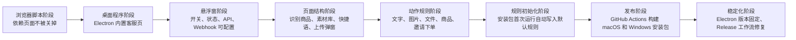
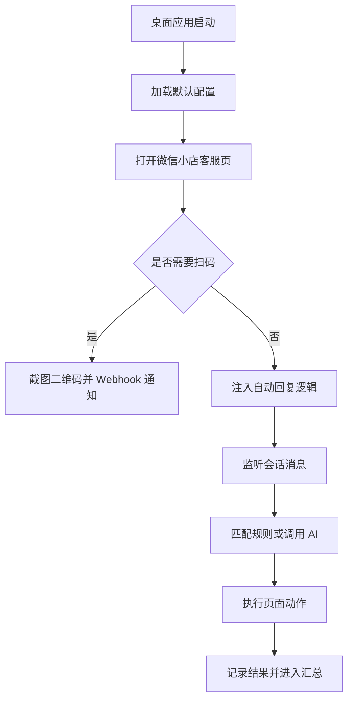
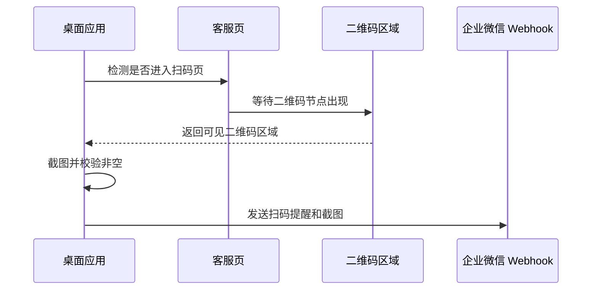
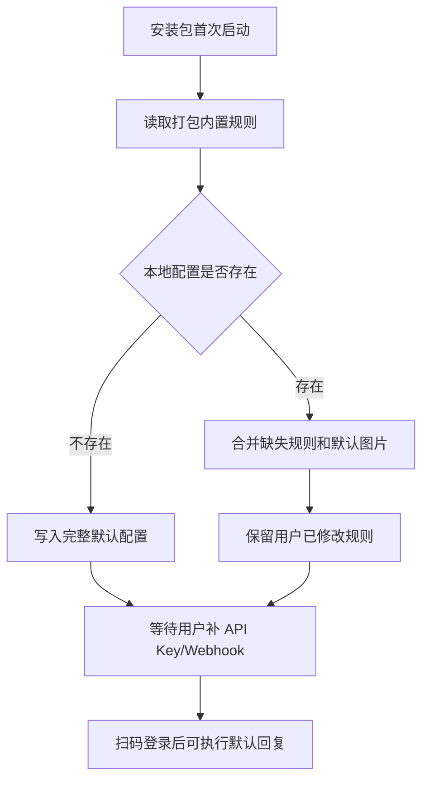
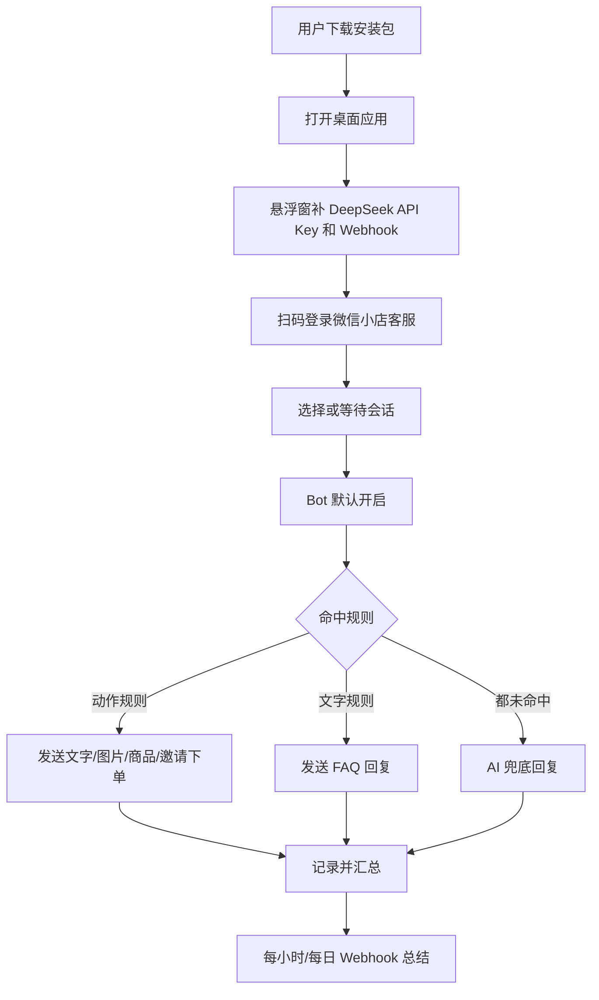

# 微信小店客服自动回复项目历程：从浏览器依赖到桌面工作台

> 这个项目的主线不是“写一个会聊天的机器人”，而是把一个容易被关掉、容易漏配、容易丢规则的浏览器自动化工具，推进成一个可以下载安装、扫码登录、补 Key 后长期运行的桌面客服工作台。

## 证据来源

这份历程文档根据这些项目材料整理：

| 来源 | 内容 |
| --- | --- |
| Git 历史 | 从 `e111c49` 到 `8ad9c46` 的 8 次主线提交 |
| 本地文档 | `README.md`、`docs/customer-reply-rule-library.md`、`docs/wechat-kf-page-structure.md` |
| 规则资产 | `config/replies.json`、`config/reply-images/`、`config/assistant-profile.json` |
| 页面探索 | 微信小店客服页结构捕捉、商品面板、素材库、快捷语、上传弹窗 |
| 发布产物 | GitHub Release `v0.1.0` 的 macOS DMG 和 Windows EXE |

## 时间线



## 第一幕：普通世界

最早的问题很朴素：客服自动回复工具必须依赖浏览器页面。浏览器标签页一关、页面刷新、电脑休眠、扫码掉线，自动回复就可能停掉。

当时工具的核心能力是“能回复”，但还不是“能值守”。这两个目标差别很大：

| 只会回复 | 能够值守 |
| --- | --- |
| 需要人工盯浏览器 | 桌面应用自己打开客服页 |
| 配置分散在文件里 | 悬浮窗集中管理 |
| 失败后不一定知道 | Webhook 主动通知 |
| 换电脑容易漏文件 | 安装包自动初始化 |
| 规则靠记忆维护 | 规则库有格式、有校验、有文档 |

于是项目的真正目标被定下来：不是替代客服，而是让机器人在平台规则允许的范围内，稳定接住高频问题，把人从重复回复里解放出来。

## 第二幕：召唤

用户明确提出了几个硬要求：

| 要求 | 背后的真实问题 |
| --- | --- |
| 独立程序 | 不想再依赖手动打开浏览器 |
| 持续运行 | 不能因为页面被关掉就停止接待 |
| 桌面悬浮窗 | 隐藏后要找得到，状态要看得见 |
| Webhook 通知 | 需要扫码、崩溃、失败时要主动提醒 |
| 图片回复 | FAQ 里很多答案必须配图才讲得清 |
| 商品卡片/邀请下单 | 客服目标不是闲聊，而是把客户引导到正确商品 |
| 规则库 | 后续要自己写“什么时候发什么” |
| 默认安装可用 | 下载后只补 API Key 和 Webhook，不应重新手工搭环境 |

这一步把项目从“脚本”推向“产品”。脚本只要跑通一次，产品要让下一次、下一台电脑、下一个安装包都跑通。

## 第三幕：跨过门槛

第一次关键转折是桌面化。

`de19310 Build desktop WeChat autoreply app` 把项目推进到 Electron 桌面应用：客服页被放进应用窗口，本地 AI 服务、悬浮窗、Webhook、守护脚本开始成为一个整体。



这一版解决了“浏览器容易被关掉”的主问题，但也暴露了第二层问题：桌面应用如果没有配置入口，使用者仍然要翻文件。

## 第四幕：试炼

### 试炼一：悬浮窗不只是状态灯

悬浮窗最初只是为了显示程序还活着。后来它被要求承担更多工作：

| 模块 | 必须能做什么 |
| --- | --- |
| 状态 | 显示客服页、Bot、AI 服务、通知状态 |
| 开关 | 默认开启，可手动暂停，可彻底关闭 |
| API | 配置 DeepSeek API Key |
| 通知 | 配置并测试企业微信 Webhook |
| 回复 | 编辑文字规则、图片规则、动作规则 |
| 助手 | 配置知识库、参考回复、语气、风格、边界 |
| 页面 | 捕捉当前客服页结构，方便后续规则迭代 |

“隐藏后找不到”的问题也改变了设计方向：桌面程序不能只有一个窗口，它需要在菜单、托盘或系统入口里重新唤起悬浮窗。

### 试炼二：二维码不能抢跑

Webhook 发送二维码截图时，不能页面一跳到扫码页就立刻截图。二维码渲染有延迟，太早截图会发出空白或半成品。

因此逻辑变成：



这一步把通知从“能发”推进到“发对”。

### 试炼三：页面动作不能靠猜

要发送商品、图片、文件、快捷语、素材库内容，必须知道微信小店客服页的结构。项目捕捉并整理了关键区域：

| 页面能力 | 自动化入口 |
| --- | --- |
| 输入框 | 文本发送、等待语、AI 兜底 |
| 上传按钮 | 图片和文件发送 |
| 商品标签 | 商品卡片、邀请下单 |
| 素材库标签 | 后续素材库内容发送 |
| 快捷语标签 | 后台快捷回复发送 |
| 二次弹窗 | 自动确认、等待结果 |

这里有一个重要边界：当前默认规则已经配置了文字、图片、商品卡片和邀请下单；素材库和快捷语的动作接口已经预留，但默认业务规则没有强行启用素材库内容，避免在没有明确规则时误发。

## 第五幕：深入洞穴

真正难的不是“写几条规则”，而是让规则在安装包里不会丢。

用户指出：测试时能发图片和商品，不代表正式打包后下载下来也能用。正式版本必须做到：

- 内置默认 FAQ 规则。
- 内置配套图片。
- 首次运行自动写入运行目录。
- 旧版本升级时补齐新规则。
- 用户已经手改过的同名规则不能被覆盖。
- API Key 和 Webhook 不能进仓库、不能进安装包。

`438f14a Ensure packaged app initializes default rules` 正是为了解这个问题。



这一步的意义很直接：下载版本不是一个空壳，而是一个带业务规则和图片资产的可运行版本。

## 第六幕：拿到宝物

项目最终沉淀出三类“宝物”。

### 1. 可读的规则库

规则库把“什么时候发什么”变成标准结构：

```json
{
  "enabled": true,
  "name": "会员专区：商品卡片",
  "keywords": ["年度会员", "会员链接", "会员入口"],
  "actions": [
    {
      "type": "text",
      "text": "这是润宇年度会员商业社群，您可以点商品卡片查看详情。"
    },
    {
      "type": "product",
      "productId": "10000275472384",
      "productName": "润宇年度会员商业社群",
      "button": "发商品"
    }
  ]
}
```

### 2. 可扩展的动作接口

| 动作 | 当前用途 |
| --- | --- |
| `text` | 发送文字 |
| `image` | 发送本地图片 |
| `file` | 发送文件 |
| `product` | 发商品卡片或邀请下单 |
| `material` | 预留素材库内容发送 |
| `quick_reply` | 预留后台快捷语发送 |
| `ignore` | 命中后不再回复 |

### 3. 可下载的安装包

`6bb9920 Publish releases for version tags` 和 `8ad9c46 Fix release workflow notes syntax` 让 GitHub Actions 在版本标签发布时自动上传安装包。

当前 Release：

- [v0.1.0 发布页](https://github.com/JahanHe/wechat-autoreply/releases/tag/v0.1.0)
- [macOS Apple Silicon DMG](https://github.com/JahanHe/wechat-autoreply/releases/download/v0.1.0/wechat-autoreply-macos-arm64.dmg)
- [Windows 安装版](https://github.com/JahanHe/wechat-autoreply/releases/download/v0.1.0/wechat-autoreply-windows-setup.exe)
- [Windows 便携版](https://github.com/JahanHe/wechat-autoreply/releases/download/v0.1.0/wechat-autoreply-windows-portable.exe)

## 第七幕：带着答案回来

最终，项目从“能回复”变成了“可交付”：

| 阶段 | 代表提交 | 结果 |
| --- | --- | --- |
| 初始化 | `e111c49` | 建立基础项目 |
| 桌面化 | `de19310` | Electron 桌面应用、悬浮窗、Webhook、AI 服务 |
| CI 修复 | `d233e76` | Windows/macOS 构建链路跑通 |
| 发布收敛 | `581a89a` | 避免 main 每次自动发布 |
| 稳定运行 | `31c14b2` | 固定 Electron 版本，降低运行崩溃风险 |
| 默认规则 | `438f14a` | 安装包首次运行自动初始化规则和图片 |
| Release | `6bb9920` | 标签触发正式 Release 上传 |
| 语法修复 | `8ad9c46` | 修复 Release Notes 工作流语法 |

## 项目现在的运行逻辑



## 仍然保留的边界

这个项目不会绕过平台登录、验证码或风控。需要人工扫码时，它会通知；页面结构变化时，它会捕捉结构并暴露接口；Webhook 和 API Key 必须由使用者自己配置，不能提交到仓库或打进安装包。

这也是整个项目最重要的工程原则：自动化是为了稳定完成客服动作，不是为了绕开平台边界。

## 下一步演进

| 方向 | 目标 |
| --- | --- |
| 规则编辑器可视化 | 把 JSON 规则变成表单式编辑 |
| 规则命中回放 | 查看某条客户消息为什么命中某条规则 |
| 商品库同步 | 从页面或后台导出商品码，减少手填 |
| 素材库规则 | 在确认素材名称和业务场景后启用默认素材规则 |
| 签名发布 | 接入 macOS/Windows 代码签名，减少系统安全提示 |

这个项目走到 `v0.1.0`，最核心的胜利不是“机器人会说话”，而是：下载、配置、扫码、回复、通知、升级，这条链路已经被连起来了。
