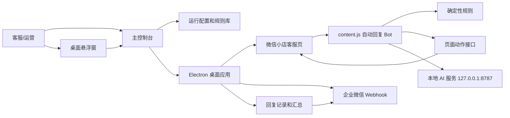
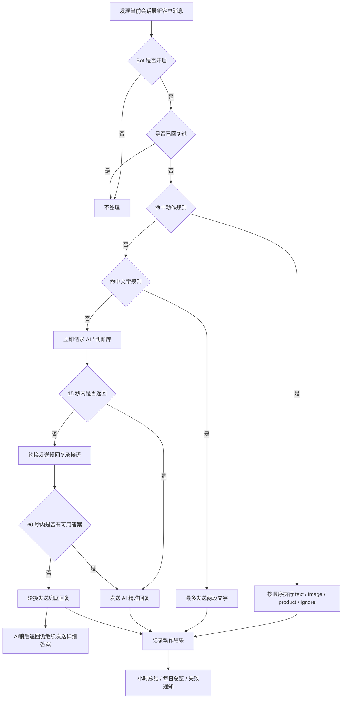
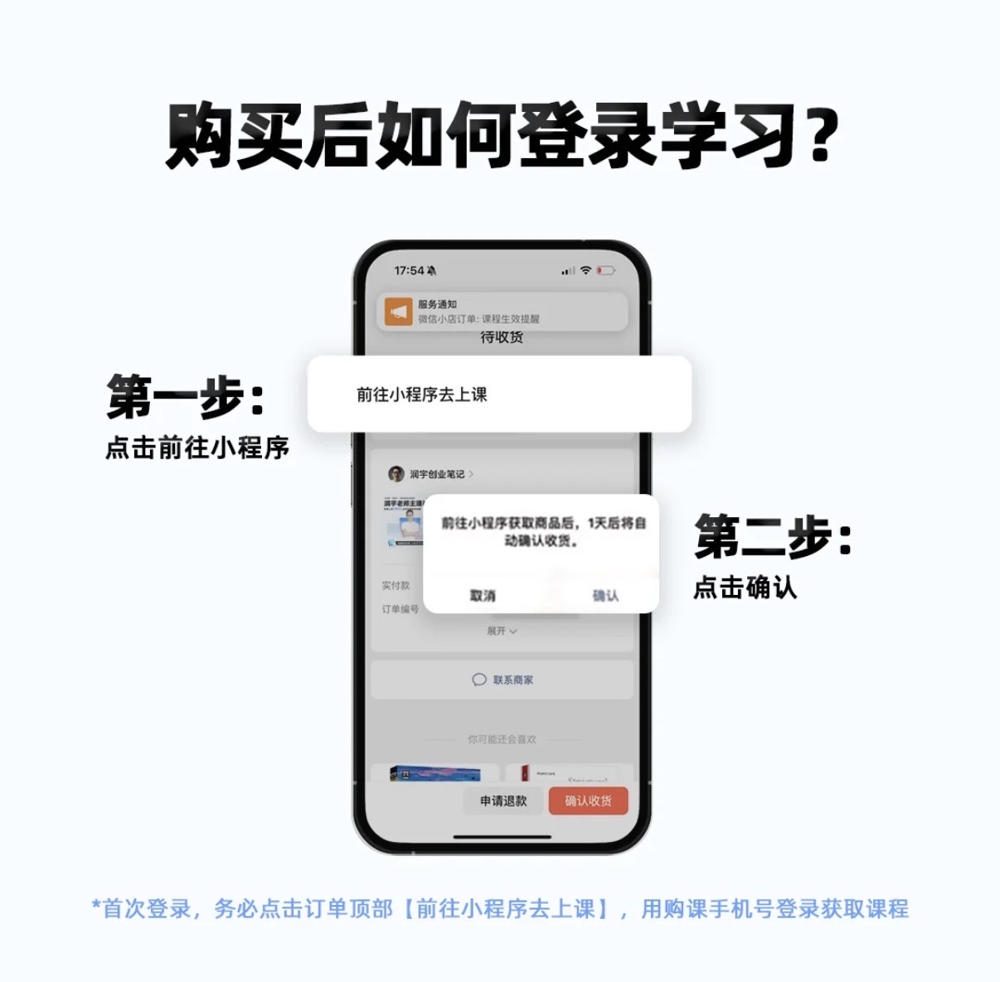
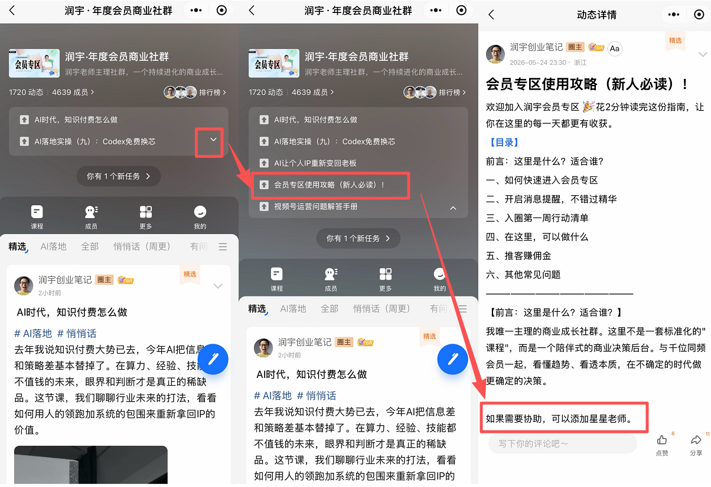
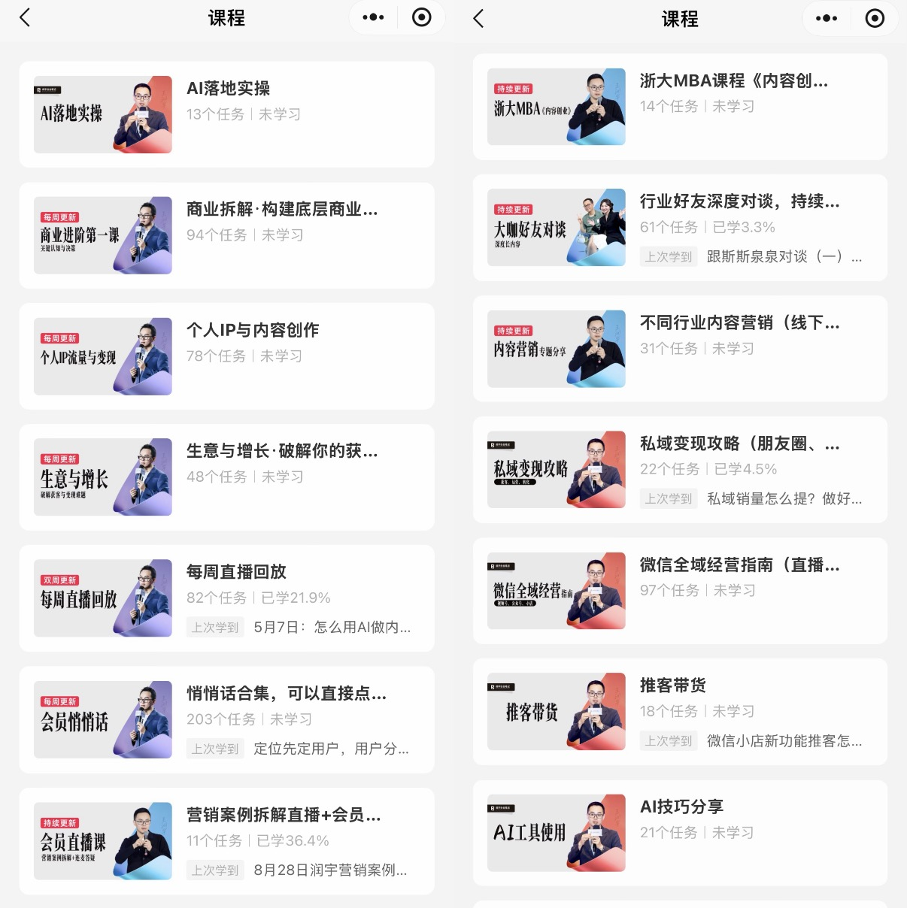
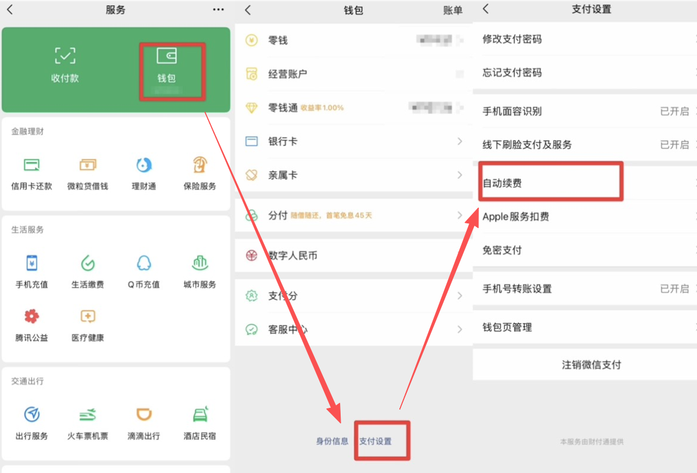
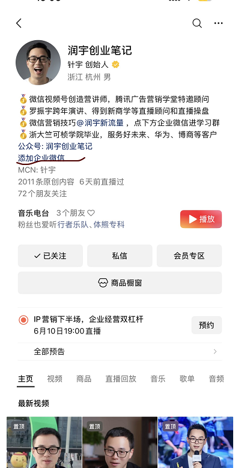
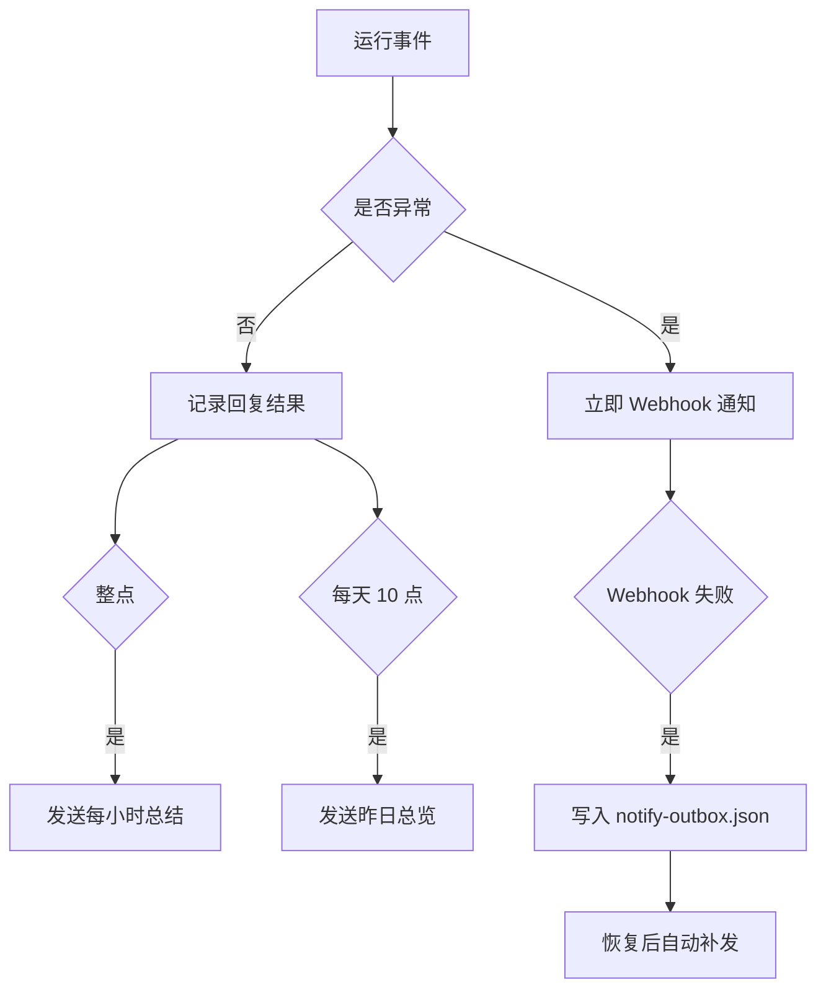

# 小店AI客服富文本使用说明

> 这份文档面向安装者、店铺运营者和后续维护者。目标很简单：下载安装包后，只补充 DeepSeek API Key、企业微信 Webhook，再扫码登录微信小店客服页，其它规则、图片、商品动作和悬浮窗能力都应该自动准备好。

## 一句话定位

这是一个把微信小店客服页封装成桌面应用的自动回复工具。它不是单纯的浏览器脚本，而是一个带主控制台、客服页映射、悬浮窗、规则库、本地 AI 服务、页面动作接口、Webhook 通知和安装包发布流程的桌面客服工作台。

## 下载安装

正式安装包在 GitHub Releases：

- [macOS Apple Silicon DMG](https://github.com/JahanHe/wechat-autoreply/releases/download/v0.3.8/wechat-autoreply-macos-arm64.dmg)
- [Windows 安装版](https://github.com/JahanHe/wechat-autoreply/releases/download/v0.3.8/wechat-autoreply-windows-setup.exe)
- [Windows 便携版](https://github.com/JahanHe/wechat-autoreply/releases/download/v0.3.8/wechat-autoreply-windows-portable.exe)

首次打开后会先进入初始化页：

| 步骤 | 位置 | 用途 |
| --- | --- | --- |
| 1 | 主控制台 > 初始化 | 填 `DEEPSEEK_API_KEY` 和企业微信 Webhook |
| 2 | 主控制台 > 初始化 | 点“打开登录网页”，5 分钟内完成润宇网页登录 |
| 3 | 主控制台 > 初始化 | 点“我已登录，获取凭证”，真实查询通过后自动初始化 10 条引用缓存 |
| 4 | 主控制台 > 初始化 | 点“保存并自检”，检查 AI、Webhook、判断库、规则库和长期运行状态 |
| 5 | 主控制台 > 客服页映射 | 微信扫码登录小店客服 |

如果三项配置已经齐全，程序会直接进入客服页映射；如果换电脑后缺任意一项，会再次打开初始化页。

外部判断库默认通过应用内网页登录接入。每台电脑第一次使用时依次点击“打开登录网页”和“我已登录，获取凭证”。程序会检测 `session_token`、保存到本机、强制查询远端接口，再下载首次 10 条引用数据。只有真实查询成功才显示连接成功，本地缓存不会造成误判。

登录监控会显示 5 分钟倒计时、Token 检测、远端验证、缓存初始化、错误码和最近凭证记录。Cookie 过期时点“重新登录”；网络问题处理后点“自检 Cookie”；查询成功但缓存为空时点“初始化引用库”。错误和恢复都会通过 Webhook 通知。手工粘贴 Cookie 只作为备用，Base URL 保持 `https://runyuai.zhiduoke.com.cn`。

主控制台和悬浮窗会同步显示检测、规则匹配、判断库、AI 思考、文字、图片、商品、文件和异常步骤。短状态统一控制在 6 个字符以内，完整含义见 [运行状态说明](runtime-statuses.md)。

## 自动初始化内容

正式安装包启动时会自动写入这些运行资产：

| 自动生成项 | 文件或目录 | 说明 |
| --- | --- | --- |
| 运行配置 | `desktop-config.json` | 开关、规则、通知、悬浮窗大小 |
| 助手资料 | `assistant-profile.json` | 回复风格、知识库、边界和审核提示 |
| 回复图片 | `config/reply-images/` | 图文规则所需图片 |
| 文字规则 | `bot.rules` | FAQ 类纯文字回复 |
| 页面动作规则 | `bot.actionRules` | 文本、图片、商品、邀请下单组合 |
| Webhook 汇总默认值 | `notify.*` | 每小时总结、每日 10 点昨日总览 |

旧版本升级时，程序会自动补齐新版内置规则；同名规则如果已经被你手动改过，会保留本地版本。

## 总体结构图



## 回复决策流程



## 默认业务能力

当前内置规则围绕“润宇年度会员商业社群”配置：

| 能力 | 触发方向 | 默认动作 |
| --- | --- | --- |
| 年度会员商品入口 | 想买会员、会员链接、会员入口 | 发商品卡片 |
| 邀请下单 | 怎么买、怎么付款、怎么下单 | 邀请下单 |
| 会员权益说明 | 会员权益、课程目录、包含什么 | 文字加目录图 |
| 使用和进群 | 怎么使用会员专区、怎么进群 | 文字加两张说明图 |
| 月度会员取消 | 取消自动续费、App Store 订阅 | 文字加图 |
| 咨询俱乐部 | 咨询俱乐部、产品详情 | 文字加图 |
| 联系方式限制 | 加微信、微信号、留电话、留手机号 | 平台内沟通提示 |
| 道谢结束 | 谢谢、明白了、OK | `ignore`，不再补话 |

## 规则图片预览

这些图片会被打进安装包，并在首次启动时复制到运行目录。为避免 GitHub 表格里图片过大，下面只做缩略预览。

| 图片 | 用途 |
| --- | --- |
|  | 会员专区使用说明 |
|  | 进群/小程序路径补充 |
|  | 会员权益和目录说明 |
|  | 月度会员取消自动续费 |
|  | 咨询俱乐部详情 |

## 页面动作规格

规则优先在主控制台 > 规则库里用卡片编辑；高级 JSON 只作为批量迁移和排查入口。

```json
{
  "enabled": true,
  "name": "会员专区：邀请下单",
  "keywords": ["怎么付款", "怎么买", "怎么购买", "怎么下单", "我要下单"],
  "actions": [
    {
      "type": "text",
      "text": "我给您选好年度会员\n您点进去就可以下单"
    },
    {
      "type": "product",
      "productId": "10000275472384",
      "productName": "润宇年度会员商业社群",
      "button": "邀请下单"
    }
  ]
}
```

可用动作：

| 动作 | 字段 | 说明 |
| --- | --- | --- |
| `text` | `text` | 发送文字，默认最多拆成两段 |
| `image` | `path` | 上传并发送本地图片 |
| `file` | `path` | 上传并发送文件，当前无默认文件规则 |
| `product` | `productId`, `button` | 发商品或邀请下单 |
| `material` | `subtab`, `query` | 发素材库内容 |
| `quick_reply` | `query` | 发后台快捷语 |
| `ignore` | 无 | 命中后不发送 |

图片和文件路径在主控制台 > 规则库里可直接操作：手动编辑路径，点“选择/替换”改成新图片或文件，点“打开位置”直达当前文件所在目录。

## 通知和汇总



即时通知包含：

- 客服页需要扫码登录，并发送二维码截图。
- AI 服务缺少 API Key 或请求异常。
- 回复失败、超时、页面崩溃、页面跑偏。
- 图片或文件路径缺失。

成功回复不会逐条刷屏；成功内容进入每小时和每日汇总。

## 常见问题排查

| 现象 | 最可能原因 | 处理 |
| --- | --- | --- |
| 发图片/发商品都失败 | 还停在扫码页，没进 `/shop/kf` 客服工作台 | 扫码登录并选中测试会话 |
| AI 不回复 | 未填 DeepSeek API Key | 主控制台 > API 接入 填写后保存 |
| Webhook 不通知 | 未填 Webhook 或企业微信机器人地址失效 | 主控制台 > Webhook，保存后点测试 |
| 判断库显示 Cookie 过期 | 当前电脑的 `session_token` 已失效 | 点“重新登录”，登录后点“我已登录，获取凭证” |
| 判断库显示 404 | Base URL 带了接口路径或网络解析异常 | Base URL 只保留域名，保存后点“自检 Cookie” |
| 判断库查询成功但缓存为 0 | 首次引用数据没有落入本地缓存 | 点“初始化引用库”，复制错误码和最近记录反馈 |
| 规则看起来没加载 | 旧运行配置覆盖过新版规则 | 新版会自动补齐；也可在主控制台 > 规则库检查 |
| macOS 提示无法打开 | 未签名本地应用的系统提示 | 右键打开，或在系统设置安全性里允许 |
| Windows 提示未知发布者 | 当前安装包未代码签名 | 选择仍要运行，后续可接入证书签名 |

## 验收清单

安装后至少检查这些项：

- 悬浮窗能打开设置页。
- API 页能保存 DeepSeek API Key。
- 通知页能保存并测试 Webhook。
- 回复页能看到默认文字规则和页面动作规则。
- 微信小店客服页能扫码登录。
- 页面结构捕捉能看到 `商品`、`快捷语`、`素材库` 标签。
- 测试会话里图片能自动发送。
- 商品码 `10000275472384` 能执行 `发商品` 和 `邀请下单`。

## 维护入口

- 主入口：[README.md](../README.md)
- 规则标准：[docs/customer-reply-rule-library.md](customer-reply-rule-library.md)
- 页面结构：[docs/wechat-kf-page-structure.md](wechat-kf-page-structure.md)
- 部署结构：[docs/desktop-app-structure-deployment.md](desktop-app-structure-deployment.md)
- 项目历程：[docs/project-journey.md](project-journey.md)
